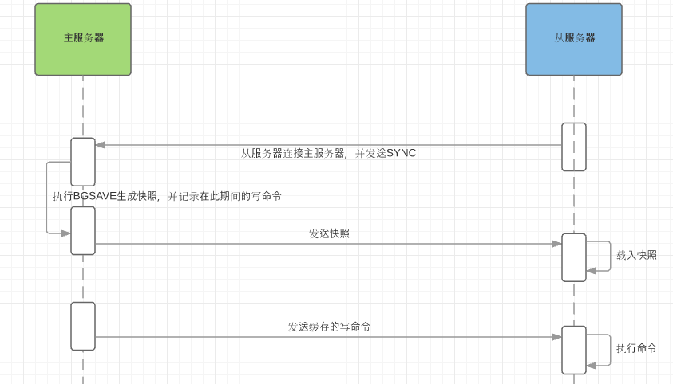

## 1. 概念

Redis 是一个基于内存的高性能 Key-Value 数据库。

## 2. 特点

* 纯内存操作，因此，性能十分出色。当然了，内存的数据可通过异步操作把数据持久化到硬盘存储。
* Redis 的出色不仅仅因为性能，支持多种数据结构（5种，String, hash, list, set, sorted set），此外单个 value 的最大限制是 1G，不像 memcached 只能保存 1MB 数据。
* 消息队列服务，Redis 通过 Subsribe、Unsubscribe、Publish 三个命令实现了发布与订阅信息范型。

* 主要缺点在于数据库容量收到物理内存限制，不能做海量数据高性能数据，因此 Redis 适合的场景主要局限在较小量的高性能操作和运算上。

## 3. 优点

1. 速度快，存储结构类似 HashMap，查找和操作时间都是O(1)。
2. 支持丰富数据类型，支持 String, hash, list, set, sorted set。
3. 支持事务，操作都是原子性。
4. 丰富的特性：可用于缓存，消息队列，按 Key 设置过期时间，过期自动删除。

## 4. 相对于 Memcahced 有哪些优势？

1. 数据类型更为丰富，memcached 所有值均是简单的字符串。
2. redis 可以持久化数据，包括rdb数据快照和aof日志文件两种持久化策略。
3. redis 单个 value 的最大限制为 1GB，而 memcached 只能保存 1MB 以内的数据。

4. redis 支持主从架构，在很多方面具备数据库特征，而memcached只是一个简单的K/V缓存。

## 5. Memcached 和 Redis 的区别？

1. 存储方式，memcached 将所有数据存放在内存，断电会丢失。Redis 支持两种数据持久化策略，更具有主从架构，大大提高数据的稳定性。
2. 数据支持类型，memcached对数据只支持简单的 String 类型，而 redis 更为丰富，支持 5 种数据类型。
3. 两者的底层模型、底层实现方式、通信应用协议都不一样。

## 6. 主从复制原理

### 6.1 全量同步

全量同步一般发生在从服务器 Slave 初始化阶段，这个阶段需要 Master 主服务器上的所有数据复制一份。具体步骤如下：

1. 从服务器连接主服务器，发送 SYNC 命令。
2. 主服务器收到 SYNC 命令后，开始执行  BGSAVE 命令生成 rdb 快照，发送给从服务器。
3. 从服务器收到快照文件后，丢弃所有就数据，载入收到的快照。

### 6.2 增量同步

增量复制是指 Slave 载入快照文件初始化后，开始正常工作，主服务器会将发生的操作命令同步到从服务器的过程。主服务器每执行一个写命令，就会向从服务器发送相同的写命令，从服务器接受并执行收到的写命令。

### 6.3 Redis 主从同步策略

 Redis 采用全量复制和增量复制相结合的方式，当主从刚刚连接的时候，进行全量同步，全量同步后，进行增量同步。当然，如果有需要，从服务器在任何时候都可以发起全量同步。

### 6.4 注意点

如果多个从服务器断线重启后，需要同步发起全量同步，多个请求同时出现时，可能会导致主服务器 IO 剧增宕机。

## 7. Redis 常见性能问题和解决方案：

1. master 写快照时，会阻塞主线程的工作，尤其当快照文件较大时，因此 master 最好减少写内存快照。
2. master 的 aof 日志文件，该持久化方式对性能影响较小。但是随着 aof 文件不断增大，会影响 master 重启的恢复速度，因此 master 最好不要做任何持久化工作，包括aof日志文件和rdb内存快照。如果数据比较关键，可以利用 slave 开启aof日志文件，master 每执行一次操作命令就同步给该 slave。
3. 为了保证主从复制的稳定性，最后将 master 和该同步 slave 布置在同一个局域网内。

## 8. 淘汰策略

redis 提供了 6 种数据淘汰策略：

1. Volatile-lru：从过期时间的数据集中，挑选最近最少用的数据淘汰。
2. Volatile-ttl：从过期时间的数据集中，挑选要过期的数据淘汰。
3. Volatile-random：从过期时间的数据集中任意选择数据淘汰。
4. Alleys-lru：从所有数据集中挑选最近最少使用的数据淘汰。
5. Alleys-random：从所有数据集中任意挑选数据淘汰。
6. No-enviction（驱逐）：禁止驱逐数据。

## 9. redis 并发竞争问题如何解决？

redis 为单线程模式，采用队列模式将并发访问变为串行访问。 Redis 本身没有锁的概念，对于多个客户端连接并不存在竞争。但是 Jedis 客户端对 Redis 进行并发访问时会发生连接超时、数据转换错误、阻塞、客户端关闭连接等问题，这些问题均是由于客户端连接混乱造成。对此，有2种解决办法：

1. 客户端角度，为保证每个客户端有序与 Redis 进行通信，对连接进行池化，同时对客户端读写 Redis 操作采用内部锁 Synchronized/Lock。
2. 服务器角度，利用 setnx 实现锁。