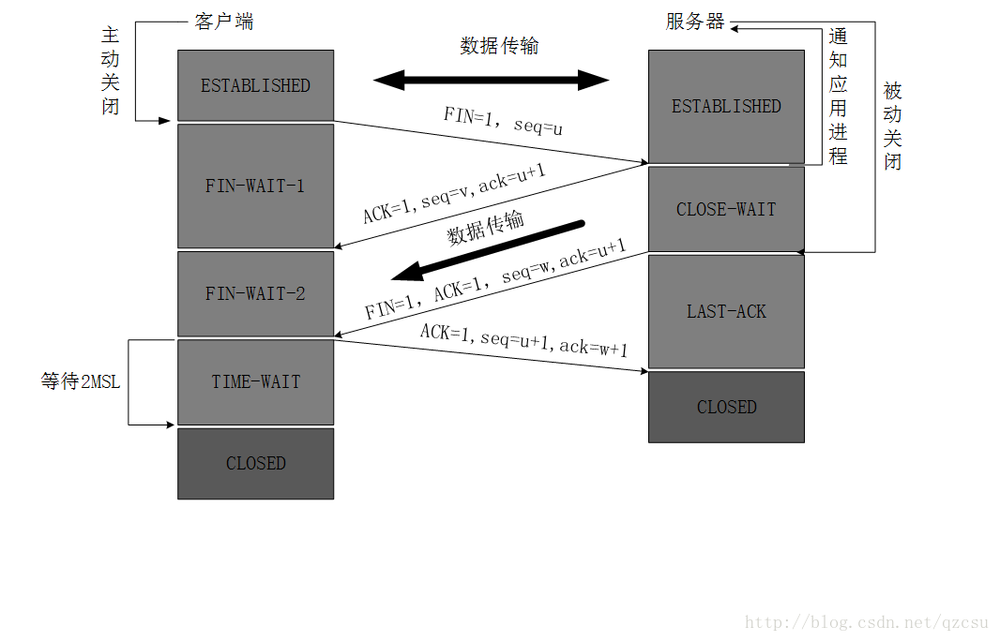

# TCP 和 UDP 浅析理解

> 本文为笔者的学习整理总结，因此，若有任何不严谨或错误之处，还望不吝指出！

**本文内容：**

```
一、TCP 详解
	1. 三次握手建立连接
		1.1 解释
		1.2 常见问题
			（1）为何是三次握手，能不能是两次握手？
			（2）如果连接建立，但是客户端突然出现故障怎么办？
			（3）什么是SYN-Flood 攻击？
	2. 四次挥手断开连接
		2.1 解释
		2.2 常见问题
			（1） 为什么客户端最后还要进入 TIME-WAIT 状态等待一定时间才关闭？
			（2）为什么连接建立只要握手三次，连接断开却需要四次挥手？
二、UDP 详解
    1. 特点
    2. 常用场景
    3. TCP 与 UDP 区别
参考
```

## 一、TCP 详解

### 1. 三次握手建立连接

### 1.1 解释

三次握手的过程如下图所见，图片来自网络（https://blog.csdn.net/qzcsu/article/details/72861891）


三次握手过程为：

1. 客户端主动发起，发送 SYN(sychronized) 包给处于 LISTEN 状态的服务器，并进入 SYN-SENT 状态。
2. 服务器回复 SYN 包 和 ACK 确认包，进入 SYN-REVD 状态。
3. 客户端收到服务器的确认后，返回 ACK 确认，并进入 ESTABLISHED 状态。
4. 服务器收到客户端的确认包后同样进入 ESTABLISHED 状态，双方通道建立，开始数据传输。

#### 1.2 常见问题

##### （1）为何是三次握手，能不能是两次握手？

三次握手主要是为了防止失效的连接请求传到服务器，服务器确认后建立了错误或不必要的连接。

比如，某个客户端向服务器发送连接请求后，因为网络原因停滞，服务器没收到该请求，客户端在等待一定时间过后，以为请求丢失，便重新发送了连接请求。第二次请求成功并收到服务器回复后，两次握手建立连接并完成了数据传输，关闭了该连接。这时，之前因为网络原因停滞的连接请求送到了服务器，服务器返回确认，连接通道又再次建立，可是双方早已完成了数据传输，此次的连接请求应为失效。因此，TCP 采用了三次握手机制，若发生该情况，客户端收到服务器的确认后，不再发回最后的确认，便避免了连接的错误建立和资源浪费。

##### （2）如果连接建立，但是客户端突然出现故障怎么办？

TCP 设置有一个保活计时器，服务器每次收到客户端的请求后，都会刷新该计时器，若时间耗尽，服务器会发送一个探测报文，若还是没有回复，隔一段时间后重复发送探测报文，若一连 10 个探测报文都没有反应，服务器就认为客户端出现了故障，便关闭连接。

##### （3）什么是SYN-Flood 攻击？

SYN-Flood 是 DOS 攻击的一种，利用发送大量的半连接信息而消耗大量的系统资源和网络带宽，使得服务器没有余力处理普通用户的请求。

利用的 TCP 三次握手的机制缺陷，模拟发送 SYN 包给服务器，服务器收到连接请求后，返回 SYN + ACK 包后，不再回复服务器，使服务器不断重试并等待一定时间的状态。

## 2. 四次挥手断开连接

### 2.1 解释

四次挥手过程如下图所示，图片来自网络（https://blog.csdn.net/qzcsu/article/details/72861891）



主要过程为：

1. 客户端主动发起关闭，首先发送一个 FIN 包给服务器，并进入 FIN-WAIT-1 状态。此时客户端写通道关闭，但是读通道仍开放，继续接受服务器发送来的数据。
2. 服务器收到后，回复 ACK 包，进入 CLOSE-WAIT 状态。此时服务器的读通道关闭，但是写通道扔开放，继续发送数据给客户端。
3. 客户端收到确认包后，进入 FIN-WAIT-2 状态。
4. 服务器完成数据传输后，发送 FIN + ACK 包给客户端，进入 LAST-ACK 状态。
5. 客户端收到后，回复 ACK 包，并进入 TIME-WAIT 状态，一定时间后自动进入 CLOSE 关闭状态。
6. 服务器收到客户端返回的确认后，进入 CLOSE 关闭状态。

### 2.2 常见问题

##### （1） 为什么客户端最后还要进入 TIME-WAIT 状态等待一定时间才关闭？

* 为了保证客户端收到服务器的关闭请求后，回复的 ACK 确认成功送到服务器。服务器发送的 FIN + ACK 包关闭连接请求，可能因为网络原因等迟迟收不到客户端的确认回复而重新发送 FIN + ACK 包给客户端，那么客户端可以在这个时间关闭前进行回复。
* 在等待关闭这段时间，足够使得本连接时间所产生的所有报文段都从网络中消失，防止新的连接中不会出现该旧的连接请求。

##### （2）为什么连接建立只要握手三次，连接断开却需要四次挥手？

因为 TCP 为全双关通道，双方都可进行读写。在三次握手建立通道时，双方进入 ESTABLISHED 状态都可同时开始读写。而断开连接时，需要读写通道分开关闭：客户端发送 FIN，服务器回复 ACK，关闭客户端的写和服务器的读通道；后来，客户端发送 FIN + ACK，客户端返回 ACK，关闭客户端的读和服务器的写通道。

## 二、UDP 详解

### 1. 特点

UDP 的主要特点为：

* 无连接，发送数据无需建立连接，因此减少了开销和时延。
* 不保证可靠交付。
* 面向报文，即 UDP 对应用层教下来的报文不进行拆分合并等处理，而是保留报文的边界，添加首部后传递给下一层。
* 没有阻塞控制，因此网络出现的阻塞不会使发送方降低发送速率。
* 支持一对一、一对多、多对一和多对多的交互通信，即提供广播和多播功能。
* 首部开销较小，首部只有 8 个字节， TCP 首部有 20 个字节。

### 2. 常用场景

UDP 常用于对无可靠性交付需求，实时要求高的场景：

* 在线语音、视频
* DNS 协议的传输
* RIP 路由选择协议
* 远程文件服务
* 流式多媒体通信

### 3. TCP 与 UDP 区别

两者的区别，其实就是两者的特点相反：

* TCP 面向连接，因此可靠交付，计算、时间消化较大；UDP 无连接，因此不保证可靠交付，更具效率和实时。
* TCP 面向字节流，应用层传递下来的报文被 TCP 进行拆分整合；UDP 面向报文，保留边界只是加了首部。
* TCP 有拥塞控制，因此网络出现拥塞会使发送方降低速率；UDP 没有拥塞控制，因此速率不会改变，这对于实时性要求高的，比如网络电话、视频等十分有用。
* TCP 为点到点；UDP则支持一对一、一对多、多对一和多对多的广播和多播通信。
* TCP 首部开销 20 个字节；UDP 首部开销仅 8 个字节。
* TCP 的逻辑通信信道为全双工的可靠信道；UDP 则是不可靠信道。

## 参考

[[1] TCP的三次握手与四次挥手（详解+动图）](https://blog.csdn.net/qzcsu/article/details/72861891)

[[2] TCP和UDP的优缺点及区别](https://www.cnblogs.com/xiaomayizoe/p/5258754.html)

