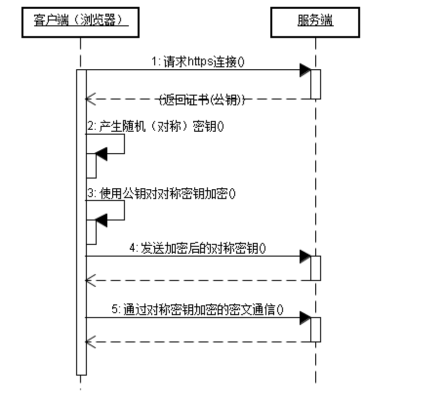

# http 与 https 的区别、优劣、原理浅析

> 写在前面，本文为笔者学习整理总结，因此，若有不严谨或错误之处，望不吝指教。

**本文内容：**

```
一. http 和 https 的区别
二. https 如何工作？
三. https 的优劣？
```

## 一. http 和 https 的区别

简单来说，http 是基于 TCP 的无连接、无状态的 HTTP 协议，而 https 则是基于在 TCP 协议之上，加了一层 SSL/TSL 协议，该协议会结合证书对客户端和服务器之间的通信进行加密，确保安全和可信。

由此引发了区别如下：

* http 明文传输无加密，而 https 对通信信息进行了加密。
* https 需要申请 CA 证书，并且通信过程，由于加解密过程带来额外的时间和计算的消耗。
* 基于 TCP 协议的 HTTP 协议，默认端口为 80，而基于 SSL/TSL 协议的 HTTPS 协议端口为 443。

## 二. https 如何工作？

HTTPS 协议的工作流程主要步骤如下：

1. 客户端使用 https 的 url 访问服务器 443 端口，要求建立 ssl 连接。
2. 服务器收到请求后，将网站的证书信息（CA 证书的公钥）传送一份给客户端。
3. 客户端收到公钥后，首先会验证证书是否存在问题，若没有问题，就生成一个随机值，然后用服务器给的公钥对该随机值进行加密，发送给服务器。
4. 服务器端收到数据后，利用证书的私钥进行解密，得到随机值。将该随机值作为后继通信的私钥，对后继的传输信息进行加密。
5. 客户端后继收到的数据，利用该随机值进行解密，得到真正的内容。

过程用图片（图片来自网络 http://www.liqwei.com/network/protocol/2012/906.shtml）表示如下：



## 三. https 的优劣？

相较于 http 的明文传输，https 最大的优势在于安全优势：

* 确保通信数据发送给正确的客户端和服务器端。
* 通过数据加密，防止数据的正确性、完整性。
* 当然，并非绝对安全，但该协议大幅度增加了攻击成本。

正因如此，https 相对于 http 明显的劣势在于开销效率：

* 增加计算开销，因此较为费时和低效。
* ssl 证书需要费用，且功能与费用挂钩。
* HTTPS 协议加密范围有限，且该信用体系安全性并不高，特别对于某些国家可以控制 CA 根证书情况下，中间人攻击一样可行。