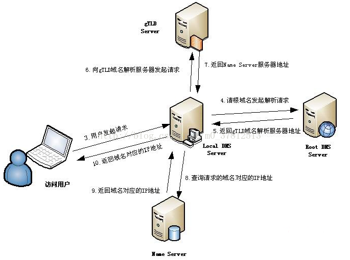

# 通过浏览器访问百度全过程

> 本文为笔者的学习整理总结，因此若有任何不严谨或错误之处，还望不吝指教！

**本文内容：**

```
1. DNS 域名解析
2. 向服务器请求数据
3. 涉及的协议
```

## 1. DNS 域名解析

首先，需要将 `www.baidu.com` 通过 DNS 解析获得百度的 IP 地址。

那什么是 DNS (Domain Name System，域名系统)：

* 因特网上作为域名和 IP 地址相互映射的一个分布式数据库，能够使用户更方便的访问互联网，而不用去记住能够被机器直接读取 IP 数串。
* 通过主机名，最终得到该主机名对应的 IP 地址的过程叫做域名解析（或主机名解析）。
* DNS 协议运行在 UDP 协议之上，使用端口为 53。
* 在整个互联网体系中，约定俗称的用于标识网络上设备的地址是 IP，然而我们输入的是 DNS，因为域名更方便人们记忆。

DNS 域名解析可以简单概括为 ：

`浏览器缓存 -> 系统 host 缓存 -> 本地域名服务器 LDNS -> Root Server -> 主域名服务器 gTLD DNS -> Name Server (BAIDU-DNS) -> LDNS 缓存并返回 ip 地址`

具体过程为：

1. 浏览器首先查询浏览器的缓存，因为浏览器会按照一定的频率缓存 DNS 记录。
2. 若浏览器无缓存，那么查询操作系统的 HOST 文件，查询是否有 DNS 记录。
3. 若还没有命中域名，就请求本地域名服务器（LDNS），这台服务器一般在城市的某个角落，距离客户端不会很远。该服务器一般都会缓存域名查询结果，因此大部分域名解析都能在这里解析完成。
4. 若LDNS还没有命中，就LDNS请求根服务器（Root Server）请求帮助，根服务器返回 LDNS 一个所查询域的主域名服务器（gTLD DNS，国际顶尖域名服务器，如.com，.cn，.org等），这里访问的是 `www.baidu.com` 百度，即返回 .com 的主域名服务器。
5. LDNS 继续访问 gTLD Server，查找这个域名对应的 Name Server 地址，即网站注册的域名服务器 BAIDU-DNS。
6. LDNS 继续访问 BAIDU-DNS Server，根据映射关系表找到目标  IP 地址，返回给 LDNS。
7. LDNS 拿到 IP 地址后，对这个域名和 IP 地址进行缓存，并将 IP 地址返回给请求客户端，即我们的浏览器，至此，DNS 域名解析过程结束，拿到域名对应的 IP 地址。

用图片（图片来自 https://blog.csdn.net/m0_37812513/article/details/78775629）表示如下所示：



## 2. 向服务器请求数据

拿到百度的服务器地址后，浏览器开始向该 IP 地址发起 HTTP/HTTPS 会话请求，而  HTTP/HTTPS 协议皆基于 TCP 协议，因此，在进行 HTTP 请求之前，浏览器还需要与百度服务器进行三次握手，建立 TCP 连接。因此，步骤如下：

1. 与服务器进行三次握手，建立 TCP 连接。
2. 发出 HTTP/HTTPS 请求，由于我们访问的是 `www.baidu.com` ，因此请求的是百度首页。
3. 服务器响应数据发送给客户端浏览器，即百度首页数据。
4. 通过四次挥手，TCP 连接释放。
5. 浏览器对首页数据进行解析渲染，将最终的页面效果展示给用户。

### 3. 涉及的协议

* HTTP/HTTPS，应用层，客户端向服务器发起 HTTP 会话请求。
* DNS，应用层，域名解析服务，解析服务器的 ip 地址。
* IP，网络层，IP 数据包传输和路由选择。
* ICMP，网络层，提供网络传输过程中的差错检测。
* ARP，网络层，将本机默认网关 ip 地址映射成物理 MAC 地址。
* TCP，运输层，HTTP/HTTPS 基于 TCP 协议进行传输。
* UDP，运输层，DNS 域名解析的传输通过 UDP 协议传输。