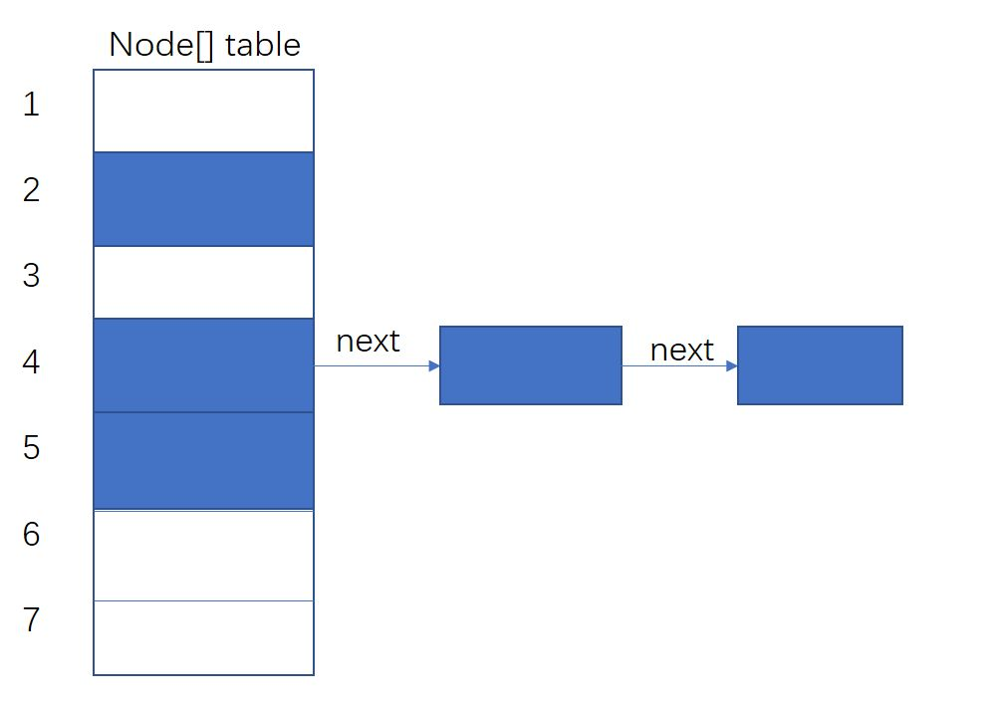
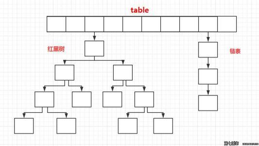
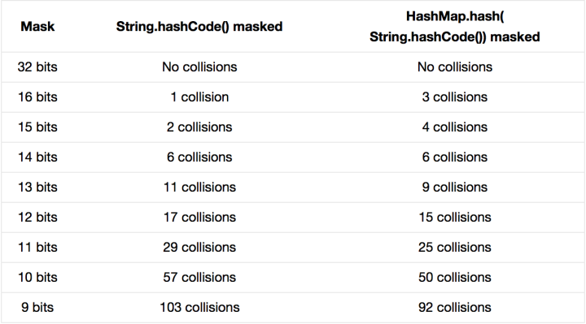

# HashMap 的多方位浅析

> 写在前面，本文为笔者学习整理总结，若有不严谨或错误之处，还望不吝指教！

**本文内容：**

```
一、 存储结构
    1. JDK 1.8 以前
    2. JDK 1.8 之后
二、 地址计算、长度总是2的整次幂问题、hash计算、扰动函数
三、 put、putVal 函数
    1. JDK 1.8 以前
    2. JDK 1.8 之后
四、 resize 扩容问题
    1. JDK 1.8 以前
    2. JDK 1.8 之后
五、 多线程问题
```

## 一、存储结构

### 1. JDK 1.8 以前

在 JDK 1.8 以前，存储结构采用的是数组与链表相结合的方式，数组存储的是链表的链头，链接下一个节点。存储方式如下图所见（图片来自网络搜索）。也即是哈希拉链法，该设计方式旨在解决哈希冲突（碰撞），哈希值相同时，存储于同一条链表。



### JDk 1.8 之后

1.8 以前，为了解决哈希冲突，引入了拉链法，即数组与链表相结合的方式，但是，随着数据规模增大，冲突越来越多，链表越来越长，逐渐失去了哈希的结构优势。因此，在1.8以后，引入了红黑树，当链表长度大于一定阈值时，将链表转换为红黑树，结构如下（图片来自网络搜索）。



查看默认阈值情况如下源码，默认树化的阈值为 8，而链表化的阈值为 6。

```java
/**
 * The bin count threshold for using a tree rather than list for a
 * bin.  Bins are converted to trees when adding an element to a
 * bin with at least this many nodes. The value must be greater
 * than 2 and should be at least 8 to mesh with assumptions in
 * tree removal about conversion back to plain bins upon
 * shrinkage.
 */
static final int TREEIFY_THRESHOLD = 8;

/**
 * The bin count threshold for untreeifying a (split) bin during a
 * resize operation. Should be less than TREEIFY_THRESHOLD, and at
 * most 6 to mesh with shrinkage detection under removal.
 */
static final int UNTREEIFY_THRESHOLD = 6;
```

## 二、地址计算、长度总是2的整次幂问题、hash计算、扰动函数

`HashMap` 的哈希表下标计算如下，即采用`下标 =（数组长度 - 1） & 哈希值`。采用位与操作，相较于 `%` 取余操作，效果相同，但更具运算效率。

```java
n = tab.length
int index = (n - 1) & hash
```

那么为什么要 `数组长度 - 1` 呢，这正是为何数组长度总是为 2 的整次幂的缘由所在：

因为当数组为 2 的整数次幂时，`数组长度 - 1` 正好形成了一个分布均匀有效**低位掩码**。以 `2^4` 为例，即二进制为 `10000` ，那么 `2^4 - 1` 结果为二进制 `01111`，形成了一个低 4 位掩码，和哈希值做与运算，相当于截取哈希值的低 4 位。

然而，问题又来了，如果在一个数组长度为 16 的 `HashMap` 中，插入哈希值为 `16，32，48，…`，造成了所有的值都存储到了下标为 0 的位置。 即当低位存在某种规律的重复，容易造成极大的哈希冲突，为了解决该问题，JDK 1.8 后，在计算哈希值时引入了 **扰动函数**：

```java
static final int hash(Object key) {
    int h;
    return (key == null) ? 0 : (h = key.hashCode()) ^ (h >>> 16);
}
```

即将键值的 `hashCode` 向右无符号位移 16 位，与原值进行异或操作，进而得到一个高位、低位异或计算获得的混合掩码，而不再是仅由低位构成掩码。

扰动函数的引入，减少了哈希碰撞的发生。Peter Lawley. 在专栏[《An introduction to optimising a hashing strategy》](https://www.javacodegeeks.com/2015/09/an-introduction-to-optimising-a-hashing-strategy.html)中在实验中将无扰动函数和带扰动函数做了实验比较，结果如下：



## 三、 put、putVal 函数

### 1. JDK 1.8 以前

在 1.8 以前，`put` 函数的运算过程可以概括为：

1. 计算下标。

2. 根据下标访问该数组，得到该哈希值对应的链头：

   2.1 若该链头为空，则创建节点，插入该值作为链头。

   2.2 若链头不为空，则遍历该链表，通过验证哈希值 与 `key.equals(k)` 相结合的验证方式寻找 key 值节点，并且，该结合方式也有助于减少验证的计算，因为哈希不相等必定键值不相等，相等才通过 `equals` 函数验证。

          2.2.1 若找到该键值，则修改对应值。
    
          2.2.2 否则，在链头插入该值节点。

```java
public V put(K key, V value) {
     if (key == null)
         return putForNullKey(value);
     int hash = hash(key.hashCode());
     int i = indexFor(hash, table.length);
     for (Entry<K,V> e = table[i]; e != null; e = e.next) {
         Object k;
         if (e.hash == hash && ((k = e.key) == key || key.equals(k))) {
             V oldValue = e.value;
             e.value = value;
             e.recordAccess(this);
             return oldValue;
         }
     }
     modCount++;
     addEntry(hash, key, value, i);
     return null;
}
```

### 2. JDK 1.8 之后

1.8 以后的版本，`put` 函数的底层由 `putVal` 实现，过程可以概括为：

1. 检测数组是否为空，若为空进行 `resize` 。
2. 检验该哈希值对应的下标地址是否为空，若为空，则插入该值作为新节点。
3. 检验该链头是否哈希值相等且键值相等，若是，则修改该节点的值。
4. 否则，验证该节点是否为红黑树，若是，进行 `putTreeVal` 操作插入到红黑树中（具体后诉）。
5. 若不是红黑树，即是链表，则与 JDK 1.8 之前插入方式相同（如上所述）。

```java
final V putVal(int hash, K key, V value, boolean onlyIfAbsent,
                   boolean evict) {
    Node<K,V>[] tab; Node<K,V> p; int n, i;
    if ((tab = table) == null || (n = tab.length) == 0)
        n = (tab = resize()).length;
    if ((p = tab[i = (n - 1) & hash]) == null)
        tab[i] = newNode(hash, key, value, null);
    else {
        Node<K,V> e; K k;
        if (p.hash == hash &&
            ((k = p.key) == key || (key != null && key.equals(k))))
            e = p;
        else if (p instanceof TreeNode)
            e = ((TreeNode<K,V>)p).putTreeVal(this, tab, hash, key, value);
        else {
            for (int binCount = 0; ; ++binCount) {
                if ((e = p.next) == null) {
                    p.next = newNode(hash, key, value, null);
                    if (binCount >= TREEIFY_THRESHOLD - 1) // -1 for 1st
                        treeifyBin(tab, hash);
                    break;
                }
                if (e.hash == hash &&
                    ((k = e.key) == key || (key != null && key.equals(k))))
                    break;
                p = e;
            }
        }
        if (e != null) { // existing mapping for key
            V oldValue = e.value;
            if (!onlyIfAbsent || oldValue == null)
                e.value = value;
            afterNodeAccess(e);
            return oldValue;
        }
    }
    ++modCount;
    if (++size > threshold)
        resize();
    afterNodeInsertion(evict);
    return null;
}
```

## 四、 resize 扩容问题

先看 1.8 之前，即1.7 版本，有助于后续的理解。

### 1. JDK 1.8 以前

过程可以概括为：

1. 若原先的容量已达到最大值，那么就将阈值设置为最大容量值。
2. 否则新建传入的容量空间，并通过复制的方式将原来元素移到新容器
3. 新阈值等于新容量乘于加载因子。

```java
void resize(int newCapacity) {    
    Entry[] oldTable = table;    
    int oldCapacity = oldTable.length;  
    if (oldCapacity == MAXIMUM_CAPACITY) { 
        threshold = Integer.MAX_VALUE; 
        return;  
    }  
  
    Entry[] newTable = new Entry[newCapacity];   
    transfer(newTable);                         
    table = newTable;                           
    threshold = (int) (newCapacity * loadFactor); 
}  
```

具体复制方式如下源码，过程为遍历数组，若该位置存在链表，则释放引用，并重新数组下标，逐一复制到新数组。

 ```java
void transfer(Entry[] newTable) {  
    Entry[] src = table;                  
    int newCapacity = newTable.length;  
    for (int j = 0; j < src.length; j++) {  
        Entry<K, V> e = src[j];            
        if (e != null) {  
            src[j] = null; 
            do {  
                Entry<K, V> next = e.next;  
                int i = indexFor(e.hash, newCapacity); 
                e.next = newTable[i];  
                newTable[i] = e;      
                e = next;             
            } while (e != null);  
        }  
    }  
}  
 ```

### 2. JDK 1.8 之后

前面已经介绍过，`HashMap` 数组的大小皆采用 2 的整数次幂，并且扩容时，均以两倍扩大。也就是形成的低位掩码多了 1 位，如下图所示（图片来自网络）：


(a) 组的数组大小为 16，对应 `length - 1` 的二进制为 `1111`。

扩容之后，即（b）组，数组大小为 32，对应 `length - 1` 的二进制为 `1 1111`。

因此，若哈希值的第 5 位（低位）为 0，则新数组的下标不变，若哈希值为 1，则新数组的下标等于`原下标 + 16`。


因此，JDK 1.8 版本之后做出了一个重大的改进就是，容器扩容之后，复制新元素不用再计算 hash 值从而计算心下表，只需要根据新增的位是否为 1，判断是否需要加上原来的容量。

另外，1.8 还有一个改进就是链表的复制，复制之后不再会颠倒。

源码如下：

```java
final Node<K,V>[] resize() {
    Node<K,V>[] oldTab = table;
    int oldCap = (oldTab == null) ? 0 : oldTab.length;
    int oldThr = threshold;
    int newCap, newThr = 0;
    if (oldCap > 0) {
        if (oldCap >= MAXIMUM_CAPACITY) {
            threshold = Integer.MAX_VALUE;
            return oldTab;
        }
        else if ((newCap = oldCap << 1) < MAXIMUM_CAPACITY &&
                 oldCap >= DEFAULT_INITIAL_CAPACITY)
            newThr = oldThr << 1; // double threshold
    }
    else if (oldThr > 0) // initial capacity was placed in threshold
        newCap = oldThr;
    else {               // zero initial threshold signifies using defaults
        newCap = DEFAULT_INITIAL_CAPACITY;
        newThr = (int)(DEFAULT_LOAD_FACTOR * DEFAULT_INITIAL_CAPACITY);
    }
    if (newThr == 0) {
        float ft = (float)newCap * loadFactor;
        newThr = (newCap < MAXIMUM_CAPACITY && ft < (float)MAXIMUM_CAPACITY ?
                  (int)ft : Integer.MAX_VALUE);
    }
    threshold = newThr;
    @SuppressWarnings({"rawtypes","unchecked"})
    Node<K,V>[] newTab = (Node<K,V>[])new Node[newCap];
    table = newTab;
    if (oldTab != null) {
        for (int j = 0; j < oldCap; ++j) {
            Node<K,V> e;
            if ((e = oldTab[j]) != null) {
                oldTab[j] = null;
                if (e.next == null)
                    newTab[e.hash & (newCap - 1)] = e;
                else if (e instanceof TreeNode)
                    ((TreeNode<K,V>)e).split(this, newTab, j, oldCap);
                else { // preserve order
                    Node<K,V> loHead = null, loTail = null;
                    Node<K,V> hiHead = null, hiTail = null;
                    Node<K,V> next;
                    do {
                        next = e.next;
                        // 以下便是上诉的改进
                        if ((e.hash & oldCap) == 0) {
                            if (loTail == null)
                                loHead = e;
                            else
                                loTail.next = e;
                            loTail = e;
                        }
                        else {
                            if (hiTail == null)
                                hiHead = e;
                            else
                                hiTail.next = e;
                            hiTail = e;
                        }
                    } while ((e = next) != null);
                    if (loTail != null) {
                        loTail.next = null;
                        newTab[j] = loHead;
                    }
                    if (hiTail != null) {
                        hiTail.next = null;
                        newTab[j + oldCap] = hiHead;
                    }
                }
            }
        }
    }
    return newTab;
}
```

## 五、 多线程问题

HashMap 本身不具备线程安全，若在多线程环境中可以用一下三个实现线程安全：

* Hashtable
* SynchronizedMap
* ConcurrentHashMap

这里只简单总结一下三者的显著区别，具体以后再诉：

Hashtable 的实现原理与 HashMap 基本一样，不同的是 Hashtable 的许多方法采用 Synchronized 修饰加了锁，因此具备线程安全性。SynchronizedMap 可接受所有 Map，返回 SynchronizedMap 类对象，从名字同样可以看出来，效率与前者接近。ConcurrentHashMap 相比 Hashtable 加入了 Segment 技术，将数据结构分成了若干个  Segment 块，使得锁的粒度更精小，效率更高。当然 JDK1.8 之后 ，ConcurrentHashMap 摈弃了 Segment 的技术，而是采用了 cas 算法。

## 参考

1. [HashMap的扩容机制---resize()](https://my.oschina.net/u/3787897/blog/1631312)

2. [这几道Java集合框架面试题在面试中几乎必问](https://zhuanlan.zhihu.com/p/42806127)

