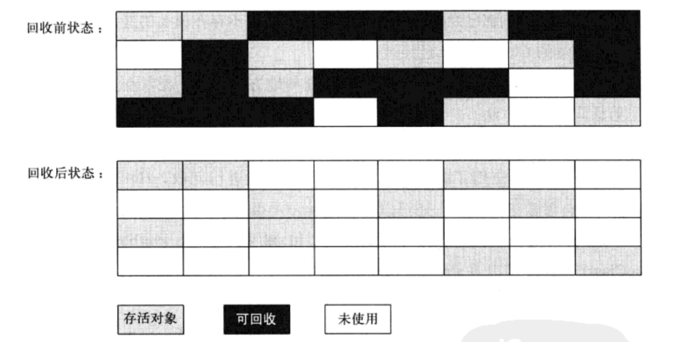
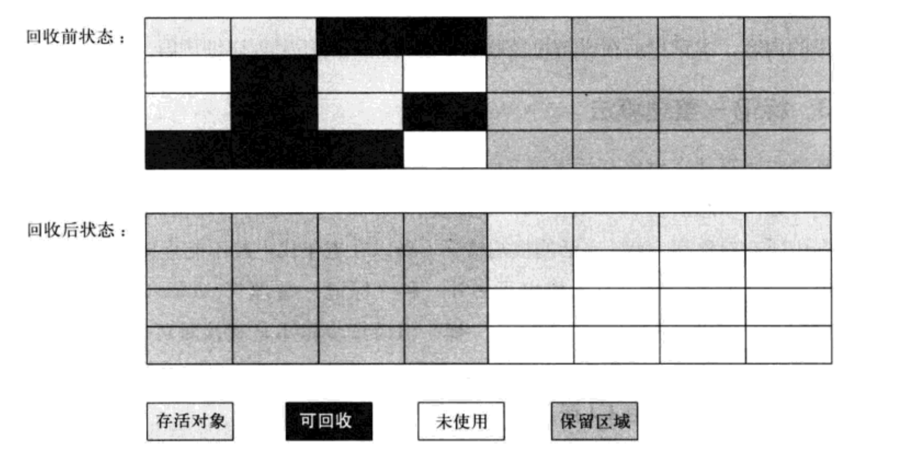
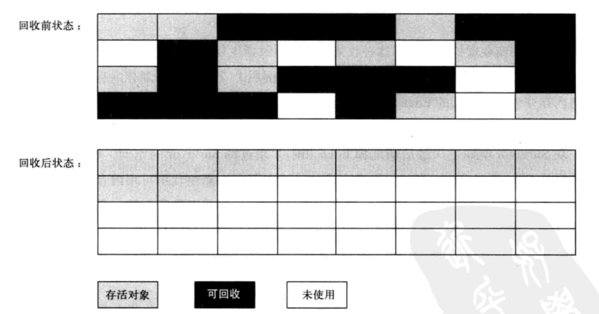

# Java 垃圾收集机制（GC）

> 写在前面：本文权当笔者学习 Java 过程的总结整理，因此，若有不严谨、错误之处，还望不吝指出。

垃圾收集（Garbage Collection, GC），内存分配与回收技术已自动化，但当垃圾收集成为系统达到更高并发量的瓶颈时，就需要我们对GC实施必要的监控和调节。

**主要内容：**

```
一. 判定回收对象
    1. 引用判定算法
    2. 引用对象类型
    3. 引用“缓刑”
    4. 方法区垃圾回收
二. 垃圾收集算法
    1. 标记-清理算法
    2. 复制算法
    3. 标记-整理算法
    4. 分代收集算法
三. 垃圾收集器
    1. Serial
    2. PreNew
    3. G1
```

## 一. 判定回收对象

垃圾回收前，首先需要判断该对象实例是否已死，是否需要回收。那么如何判定？

### 1. 引用判定算法

#### 1.1 引用计数算法

给对象中添加一个引用计数器，每有一个地方引用它，计数器加 1；当引用失效时，计数器减 1；在任何时刻计数器都为 0 时，则判定该对象已死，通知内存回收。

该算法实现简单，判定效率高，但是很难解决对象之间相互循环引用问题。

比如，`objA.instance  = objB; objB.instance = objA` ，实际上这两个对象已经不可能再被访问，但是它们因为互相引用，计数器不为 0，导致无法通知 GC 收集器回收。

#### 1.2 根搜索算法

主流的商用程序语言中，多是使用根搜索算法（GC Root Tracing）判定对象是否存活。思路就是通过一系列的名为 “GC Roots“ 的对象作为起始点，从这些节点开始向下搜索，搜索走过的路径为引用链（Reference Chain），当一个对象到 GC Roots 没有任何引用链，则证明此对象是不可用的。

在 Java 语言，可作为 GC Roots 的对象包括：

* 虚拟机栈（栈帧中的本地变量表）中引用的对象
* 方法区中的类静态属性引用的对象
* 方法区中的常量引用的对象
* 本地方法栈中 JNI（即一般说的Native方法）的引用对象

### 2. 引用类型

判定对象是否已死需要回收，不仅需要引用计数算法或根搜索算法进行判定，还与对象引用类型有关。

Java 引用类型分为强引用（Strong Reference）、软引用（Soft Reference）、弱引用（Weak Reference）、虚引用（Phantom Reference）四种，强度依次减弱。

#### 2.1 强引用

强引用的定义，比如：

`Object obj = new Object()`

只要引用存在，垃圾收集器就不会回收该引用的实例对象。除非 `obj` 已释放，收集器才会对 `new Object()` 开辟的实例空间进行回收。

#### 2.2 软引用

软引用的定义可通过：

```
Object obj = new Object();
SoftReference<Object> sf = new SoftReference<Object>(obj);
```

软引用为非必须引用，内存溢出前，进行回收。因此，常用来实现类似缓存的功能：若内存足够的情况下，直接获取该软引用的实例对象；内存不足的情况下，则该对象返回为空，只能从数据源查询。

```
因此，接上
obj = null; // 释放 obj
sf.get();   // 内存溢出前，对象被回收，返回 null
```

#### 2.3 弱引用

弱引用的定义，可通过：

```
Object obj = new Object();
WeakReference<Object> wf = new WeakReference<Object>(obj);
```

其所关联的对象只能生存到第二次垃圾收集（先标记），无论内存是否足够。

#### 2.4 虚引用

虚引用的定义，可通过：

```
Object obj = new Object();
PhantomReference<Object> pf = new PhantomReference<Object>(obj);
```

该引用通过 `get()` 方法获得的永远是 `null`，因此无法通过虚引用取得一个对象实例，每次垃圾收集时都会被回收，因此虚引用主要用来检测对象是否已被回收，并且在被回收时收到一个系统通知。

### 3. 引用 ”缓刑“

在根搜索算法中判定为不可达对象，也并非”非死不可“，真正宣告死亡，至少需要两次标记：

第一次发现该对象没有与 GC Roots 相连接的引用链后，那么对该对象进行第一次标记，并且判定是否需要执行 `finalize()`——如果该对象没有覆盖 `finalize()`，或者已被调用过一次，则直接宣判死亡；否则将该对象放进`F-Queue` 队列，等待 `Finalizer` 线程区执行促发，促发时，若重新与引用链任何一个对象建立联系，则第二次垃圾收集时，将该对象移出待回收集合，否则进行第二次标记后垃圾回收。

但并不建议通过 `finalize()` 拯救对象，因为运行代价高昂，不确定性大，无法保证各个对象的调用顺序。

## 4. 方法区垃圾回收

方法区的回收内容主要为：废弃常量和无用的类。废弃常量的回收与堆的对象回收类似，而无用类的判定需要满足：

```
1. 该类所有的实例都已经被回收，也就是 java 堆中不存在该类的任何实例。
2. 加载该类的 ClassLoader 已经被回收。
3. 该类对应的 java.lang.Class 对象没有在任何地方被引用，无法在任何地方通过反射访问该类的方法。
```

## 二. 垃圾收集算法

### 1. 标记-清除算法

垃圾回收时，首先标记需要回收的对象，完成后统一回收所有标记的对象。

缺点有二：

* 效率，标记和清除的执行效率都不高
* 空间，产生大量不连续的内存碎片



### 2. 复制算法

为了解决以上问题，复制算法应运而生，它将可用的内存容量划分为大小相等的两块，每次只使用其中一块。当这块内存用完，就将还存活的对象复制到另一块上面，然后再把该块内存空间一次清理掉。

该算法每次都是对其中一块进行内存回收，简单高效，但是缺点也明显：***每次都要将可用内存缩小为原来的一半***。

现有的商业虚拟机在回收新生代多采用该算法，因为新生代的对象实例多“朝生夕死”。只是不同公司认为划分的比例不同：IBM 认为新生代的 98% 对象朝生夕死，因此采用一块较大的 Eden 空间和两块较小的 Survivor 空间的划分方式；而 HotSpot 则认为比例是 8 ：1。



### 3. 标记-整理算法

复制算法在对象存活率高时就需要执行多次复制操作，效率变低，且为了不浪费一半空间。根据老年代特点，标记-整理算法应运而生。

与标记-清理算法类似，不同的是标记后，该算法不是直接清理，而是将所有存活的对象都移向一端，然后清理掉端边界以外的内存。



### 4. 分代收集算法

根据对象的存活周期，把 Java 堆分为新生代和老年代。这样，可以根据各个年代的特点采用适合的手机算法。

新生代中，对象“朝生夕死”，仅少量存货，因此选用复制算法进行回收。

老年代中，对象存活率高、没有额外空格键对它进行分配担保，因此选用“标记-清理”或“标记-整理”算法进行回收。

## 三. 垃圾收集器

垃圾收集器是垃圾收集算法的具体实现，不同厂商版本的虚拟机所提供的垃圾收集器可能会有很大差别。

### 1. Serial 收集器

Serial 收集器是最基本，历史最为悠久的收集器。该收集器是个单线程的收集器，执行垃圾收集时，必须暂停其他所有的工作线程。适用于运行在 Client 模式下的默认新生代收集器，因为用户的应用场景中，分配给虚拟机管理的内存一般来说不大，新生代垃圾有限，停顿时间可接受，是个简单高效的选择。

### 2.  PreNew 收集器

PreNew 收集器其实是 Serial 收集器的多线程版本，除此，与 Serial 完全相同。多用于 Server 模式下的新生代收集，可与 CMS 收集器配合。

### 3. G1 收集器

G1 收集器是基于 “标记-整理” 算法实现的收集器，因此不会产生空间碎片，这对于长时间运行的应用系统来说非常重要。

非常准确地控制停顿，既能让使用者明确制定在一个长度 M 毫秒的时间片段内，消耗在垃圾收集上的时间不得超过 N 浩渺，这几乎已经是实时 Java(RTSJ) 的垃圾收集器特征。

之所以能够在基本不牺牲吞吐量的前提下完成低停顿的内存回收，主要以由于，与其他收集器手机的范围是整个新生代或老年代不同，G1 将整个 Java 堆（包括新生代、老年代）划分为多个大小固定的独立区域，并且后台维护一个优先级列表，每次根据允许的收集时间，结合优先级，回收垃圾最多的区域。