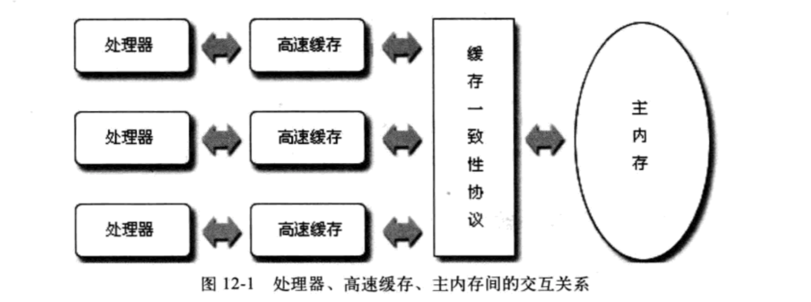
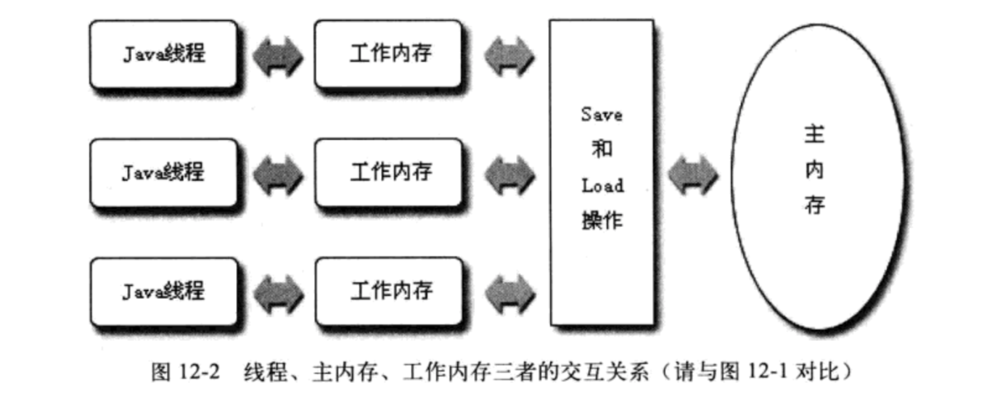
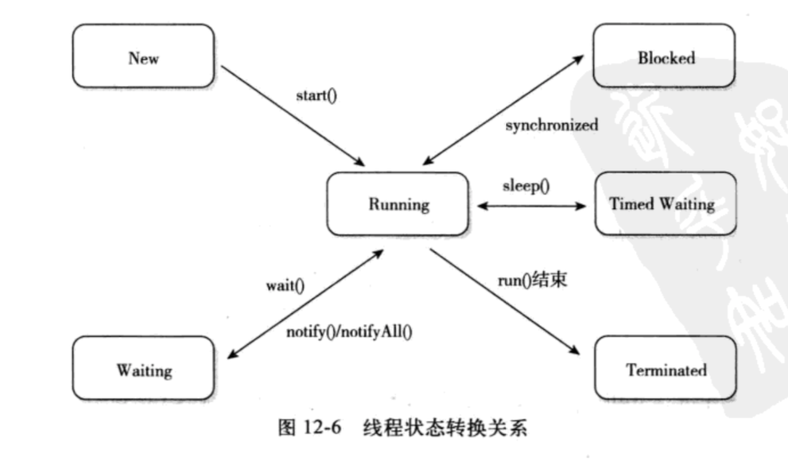

# Java 内存模型和多线程

> 本文为笔者的学习整理，若有任何不严谨或错误之处，还望不吝指出！

**本文内容：**

```
一、硬件的效率与一致性
二、Java 内存模型
	2.1 volatile
		2.1.1 特性
		2.1.2 原理
		2.1.3 效率
	2.2 原子性、可见性与有序性
三、Java 与线程
	3.1 线程的实现
	3.2 Java 线程调度
	3.3 状态转换
```

## 一、硬件的效率与一致性

为了解决计算机内存和处理器读写速度的巨大差距，计算机引入了高速缓存作为内存与处理器之间的缓冲：将运算索需要的数据和指令复制到缓存中，处理器到缓存中获取，计算完成后将结果写在缓存，再由缓存保存到内存。

高速缓存的引入解决了处理器与内存的速度矛盾，但是也引入了新的问题——缓存一致性。在多个处理器系统中，每个处理器都有自己的高速缓存，而它们又共享同一内存。因此，为了解决一致性问题，需要各个处理器访问缓存时都遵循一些协议。

除此之外，为了使得处理器内部的运算单元能够尽量充分利用，处理器可能会对某些指令乱序执行优化。与处理器乱序执行类似，JVM 也有类似指令重排的优化。



## 二、Java 内存模型

Java 内存模型规定了所有的变量都存储在主内存（Main Memory）中（此处的主内存与物理硬件的主内存名字一样，两者也可以互相类比，但是此处仅是虚拟机内存的一部分）。每条线程还有自己的工作内存（可与硬件中的高速缓存类比），线程的工作内存中保存了该线程使用到的变量的主内存副本考本，线程对变量的所有操作都必须在工作内存中进行，而不能直接读写主内存中的变量。而不同线程间的变量值传递需要通过主内存来完成，不可直接传递。



这里所讲的主内存、工作内存与 Java 内存区域中的 Java 堆、栈、方法区等并不是同一个层次的内存划分。如果一定要勉强对应起来，从变量、主内存、工作内存的定义来看，主内存主要对应于 Java 堆中对象的实例数据部分，而工作内存则对应于虚拟机栈中的部分区域。从更低的层次来说，主内存就是硬件的内存，而为了获取更好的运行速度，虚拟机及硬件系统可能让工作内存优先存储于寄存器和高速缓存中。

### 2.1 volatile

#### 2.1.1 特性

volatile 变量具备两种特性：

第一是对所有线程的可见性，这里的可见性指的是当一条线程修改了这个变量的值，新值对于其他线程来说是可以立即得知的。许多人认为可见性是由于 volatile 变量在各个线程中是一致的，事实上，各个线程的工作内存中 volatile 变量可能是不一致的，但是每次使用前都需要重新刷新，执行引擎看不到不一致的情况。volatile 只能保证可见性，并不保证原子性，在不符合两条规则的运算场景中，我们仍然要通过加锁（使用 sychronize 或 java.util.concurrent 中的原子类）来保证原子性。

第二是禁止指令重排，一般的变量仅能够保证所有依赖赋值结果的地方都能取到正确的结果，但不能保证赋值操作顺序。

#### 2.1.2 原理

通过 JIT 生成的汇编指令如下：

| 类型       | 代码                                                         |
| ---------- | ------------------------------------------------------------ |
| Java代码： | instance = new Singleton();  //instance是volatile变量        |
| 汇编代码： | 0x01a3de1d: movb $0x0,0x1104800(%esi);0x01a3de24: **lock** addl $0x0,(%esp); |

对 volatile 变量进行写操作时，JVM 就会向处理器发送一条 lock 指令，计算完成后将该变量立即写回主内存。而其他线程的缓存会通过嗅探主内存的数据检查自己的缓存的值是否过期，当处理器要对这个这个数据进行修改操作的时候，会强制重新从主内存读到缓存里。

#### 2.1.3 效率

volatitle 变量读操作的性能消耗与普通变量几乎没有什么差别，但是写操作可能会慢上一些，因为它需要在本地代码中插入许多内存屏障（Memory Barrier 或 Memory Fence）指令来保证处理器不发生乱序执行。

不过，即便如此，大多数情境下 volatile 的总开销仍然要比锁来得低，我们在 volatile 与锁中选择的唯一判断仅仅是 volatile 语义能否满足使用场景的需求。

### 2.2 原子性、可见性与有序性

Java 内存模型是围绕着并发过程中如何处理原子性、可见性和有序性三个特征来建立的：

* 原子性：由 Java 内存模型来直接保证的原子性变量操作，包括 read、load、assign、use、store 和 write 这六个，我们大致可以认为基本数据类型的访问读写是具备原子性的（long和double 除外）。如果应用场景需要一个更大范围的原子性保证，Java 内存还提供了 lock 和 unlock 操作，即 Java 代码块的同步块 sychronized。

* 可见性：Java 内存模型是通过变量修改后将新值同步回主内存，在变量读取前从主内存刷新变量值这种依赖主存作为传递媒介的方式来实现可见性，无论是普通变量还是 volatile 变量都是如此。普通变量与 volatile 变量的区别在于，volatile 保证了新值能立即同步到存储，以及每次使用前立即从主内存刷新。因此我们可以说 volatile 保证了多线程操作时的可见性，而普通变量则不能保证这一点。

  除了 volatile 之外，Java 还有两个关键字能实现可见性，分别是 synchronized 和 final。同步块的可见性是由于“对一个变量执行 unlock 前，必须先把此变量同步回主内存中” 这条规则实现的，而 final 关键字的可见性是：被 fianl 修饰的字段在构造器中一旦被初始化完成，并且构造器没有把 “this” 的引用传递出去，那么在其他线程中就能看见 final 字段的值。

* Java 提供了 volatile 和 sychronized 两个关键字保证线程之间操作具有有序性， volatile 关键字本身就包含了禁止指令重排，而 sychronized 则是由“一个变量在同一个时刻只允许一条线程进行 lock 操作”这条规则获得的，这个规则决定了同一个锁的两个同步块只能串行地进入。

## 三、Java 与线程

### 3.1 线程的实现

实现线程主要有三种方式：使用内核线程实现，使用用户线程实现，使用用户线程加轻量级进程混合实现。

1. 使用内核线程实现

内核线程就是直接由操作系统内核支持的线程，这种线程由内核来完成线程切换，内核通过操纵调度器对线程进行调度，并负责将线程的任务映射到各个处理器上。程序一般不会直接去使用内核线程，而是使用内核线程的一种高级接口——轻量级进程，轻量级进程就是我们通常意义上所讲的进程，由于每个轻量级进程都由一个内核线程支持，因此只有先支持内核线程，才能有轻量级进程。

2. 使用用户线程实现

广义上来讲，一个线程只要不是内核线程，那就可以认为是用户线程，因此从这个定义上来讲，轻量级进程也属于用户线程，但轻量级进程的实现始终是建立在内核之上的，许多操作都要进行系统调用，因此效率会受到限制。

3. 混合实现

线程除了依赖内核线程实现和完全由用户程序自己实现之外，还有一种将内核线程与用户线程一起使用的实现方式。在这种混合实现下，既存在用户线程，也存在轻量级进程。

**Java 的线程实现：**

具体根据不同平台而定，对于 Sun JDK 来说，它的 windows 版与 linux 版都是使用一对一的线程模型来实现，一条 java 线程就映射一条轻量级进程。而在 Solaris 平台中，可以同事支持一对一及多对多的线程模型。

### 3.2 Java 线程调度

线程调度是指系统为线程分配处理器使用权的过程，主要有两种调度方式，分别为协同式和抢占式：

* 协同式：线程的执行时间由线程本身来控制，线程把自己的工作执行完后，主动通知系统切换到另一个线程上去。实现简单，但是线程执行时间不可控，如果某线程阻塞，那么整个进程可能崩溃。
* 抢占式：每个线程由系统来分配执行时间。时间可控，且不会一个线程导致整个进程崩溃。

### 3.3 状态转换

Java 定义了5种进程状态，任意一个时间点中，一个进程只有有且只有其中一种状态：

* 新建：创建后尚未启动的线程状态。
* 运行（Runable）：Runable 包括了操作系统线程状态中 Running 和 Ready，也就是可能正在执行，也可能是就绪。
* 无限期等待（Waiting）：处于这个状态的进程不会被分配 cpu 时间，需要被其他线程显式唤醒。比如，没有设置 Timeout 参数的 `wait` 方法和 `join` 方法，以及 `LockSupport.park` 方法。
* 限期等待（Timed Waiting）：处于这个状态的进程也不会被分配 cpu 时间，不过无序等待其他进程唤醒，在一定时间之后，它们会由系统自动唤醒。比如，`sleep` 方法，设置了 Timeout 参数的 `wait` 和 `join` 方法，以及 `LockSupport.parkNamos` 等。
* 阻塞（Blocked）：阻塞与等待的区别在于：阻塞在等待获取一个排他锁；而等待则是等一个时间或唤醒。
* 结束：终止的线程状态，执行结束。



