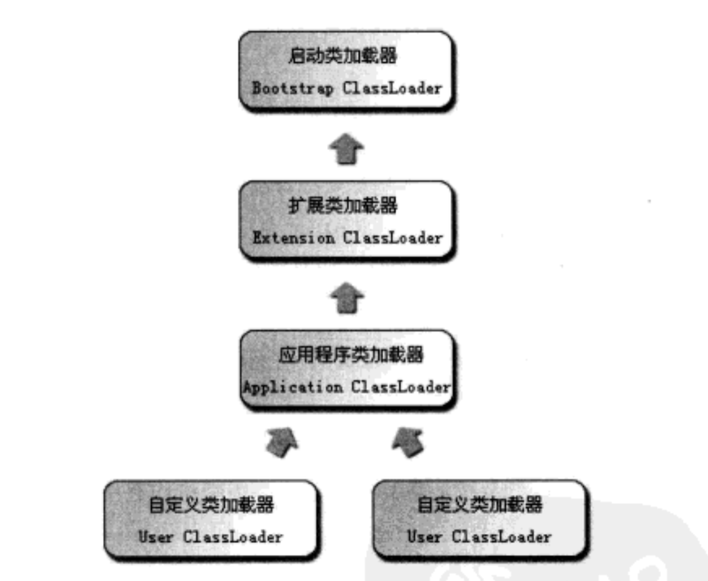

# 虚拟机类加载机制

> 写在前面，本文为笔者学习整理总结，因此若有不严谨或错误之处，还望不吝指点。

**本文内容：**

```
一、类加载过程
   1. 加载
   2. 验证
   3. 准备
   4. 解析
   5. 初始化
二、类加载器
   1. 双亲委派模型
   2. 自定义加载器
引用
```

## 一. 类加载过程

虚拟机类加载机制就是将描述类的数据从 Class 文件加载到内存，并对数据进行校验、转换解析和初始化，最终形成可以被虚拟机直接使用的 Java 类型。Java 虚拟机并不是一开始就把所有类加载进内存，而是只有需要时才进行加载，且只加载一次。

类从加载进虚拟机内存，到卸载出内存，过程主要有加载、验证、准备、解析、初始化、使用、卸载七个阶段。其中，验证、准备、解析三个阶段统称连接。而类的加载过程包括加载、验证、准备、解析、初始化五个阶段。


该过程中，只有加载、验证、准备、初始化和卸载这五个阶段顺序是确定的，而解析不一定，它可能初始化阶段之后再开始，这是为了支持 Java 的运行时绑定（动态绑定）。当然，该图只是表明开始顺序，而执行过程通常是交叉混合进行。

### 1. 加载

主要就是将二进制字节码通过类加载器，加载进虚拟机内存的方法区中按照所需格式存储。

需要注意的是：

* 二进制字节流不一定从 Class 文件中获取，可能从 ZIP 包、JAR 等读取，也可能从网络中读取，也可能运行时计算生成，如动态代理技术，等等。
* 加载阶段与连接阶段交叉进行，可能连接阶段已经开始，而加载阶段尚未完成。正如前节所言，该顺序表明的是开始顺序而非执行顺序。

### 2. 验证

验证阶段主要对加载进来的二进制字节流检查是否符合虚拟机规范，防止安全错误。

包括四个阶段验证：

* 文件格式验证，检查字节流是否符合 Class 文件格式规范，并且能被当前版本虚拟机处理。经过该阶段的验证，字节流才进入虚拟机内存的方法区，因此，后面三个验证基于方法区的存储结构。
* 元数据验证，语义分析，保证符合 java 语言规范。
* 字节码验证，主要任务保证运行时不会做出危害虚拟机安全行为。
* 符号引用验证，符号引用转化为直接引用发生在解析阶段，而符号引用验证主要对自身以外（常量池中各种符号引用）的信息进行匹配行校验，比如该类的访问性（private、protected等）能否为当前类访问等。

### 3. 准备

为类变量（仅包括 static 修饰的变量，而不是实例变量，实例变量在实例化时分配到 Java 堆）分配内存，并设定初始值。

除了变量范围，需要注意的是：

* 初始值不是给定初始值，而是数据类型的零值，比如 `public static int value = 12` 在准备阶段赋值为 0，而非 12，而引用类型则赋值 null。
* 当然，常量不同，`public static final int value = 12` 在准备阶段就赋值为 12。

### 4. 解析

主要将常量池内的符号引用替换为直接引用。主要针对类或接口、字段、类方法、接口方法四类的符号引用进行。

其中：

* 符号引用：以一组符号描述所引用的目标。符号引用的目标不一定已经加载到内存中。
* 直接引用：是直接指向目标的指针、相对偏移量或是一个能间接定位目标的句柄。直接引用的目标必定已经加载到内存。

比如，方法在解析阶段前，某方法以 `HelloWorld` 作为符号引用，解析后，转变为内存地址 `183261874`，即直接引用。


### 5. 初始化

主要将程序员给定的初始值赋给类变量（static 修饰的变量），即执行类的构造器的过程。

需要注意的是：

* 该过程只对 static 修饰的变量或语句初始化，而非所有变量。
* 优先初始化父类。
* 若该类包含多个静态变量或静态代码块，则按自上到下的顺序执行。

## 二. 类加载器

上节的加载阶段中，类的加载动作由类加载器完成。

加载的过程需要保证类的**唯一性**，也就是说，需要保证不仅来自同一个 Class 文件，更需要保证由同一个类加载器完成加载。否则，即使来自同一个 Class 文件，这两个类也必定不想等。

### 1. 双亲委派模型

类的加载器主要有：

* **启动类加载器（Bootstrap ClassLoader）**：该类在 jvm 启动时创建，负责加载 Java API（Java 核心类库），即`<JAVA_HOME>\lib `目录中的类库。该加载器采用 C++ 代码实现。
* **扩展类加载器（Extension ClassLoader）**：该类负责加载`<JAVA_HOME>\lib\ext` 目录中的扩展类库。
* **应用程序类加载器（Application ClassLoader）**：Bootstrap 和 Extension 加载 jvm 的组件，而 Application Loader 负责加载应用程序类，由用户指定路径，即 `<ClassPath>` 目录。
* **自定义类加载器（User-defined ClassLoader）**：程序开发者用代码实现的类加载器。

应用程序中的加载动作，由这四类加载器互相配合，关系如下图所示：



该模型就称为**双亲委派模型（Parent Delegation Model）**，要求除了顶层启动类加载器外，其余的类加载器都应有自己的父类加载器。而父子关系不用继承的关系来实现，而都是用组合关系来复用父加载器。当然，这并不是一个强制性约束模型，而是推荐实现方式。

工作过程：如果一个类收到加载请求，它不会立即尝试加载，而是将这个请求传递给父类加载器，每层如此，只有当父加载器反馈无法完成该请求时，该子加载器才会尝试自己加载。

该模型保证了类加载的唯一性，比如，接到加载`Object` 类请求时，全部传递到启动类加载器进行加载，保证了该类的唯一性。

### 2. 自定义加载器

启动类加载器和扩展类加载器负责加载虚拟机组件，而应用程序加载器加载 `classpath` 目录，当我们需要对这三个路径之外的类文件进行加载，需要我们自定义加载器。

自定义加载器，只需要继承 `ClassLoader` 类，并重写 `findClass(String name)` 方法。当然，也可以重写 `loadClass(String name)`，只是 jdk1.2 之后，双亲委派模型已经被引入到类加载体系中，自定义类加载器不需要自己写双亲委派逻辑，因此不鼓励重写该方法，推荐重写前者。

## 引用

[[1] 面试官：请你谈谈Java的类加载过程](https://blog.csdn.net/ln152315/article/details/79223441)

[[2] 为什么要类加载器，类加载器做了什么，加载类的过程](https://blog.csdn.net/xiaoliuliu2050/article/details/53023734)


