# Perceptual Losses for Real-Time Style Transfer and Super-Resolution

论文:

[Perceptual Losses for Real-Time Style Transfer and Super-Resolution - CVPR 2016](https://arxiv.org/abs/1603.08155)

## 1. 摘要

本文针对 [A Neural Algorithm of Artistic Style - CVPR 2015](https://arxiv.org/abs/1508.06576) 一文的风格化方法的缺点，本文提出了采用感知损失函数训练前馈网络进行图像转换的任务。实验证明，本文方法产生了质量相当的结果，却能得到三个数量级的提速。另外，本文还实验了单图高分辨率重建，同样采用感知损失函数代替逐像素差距的损失函数，取得了很好的效果。

## 2. 相关工作

#### 深度残差网络（ResNet）

ResNet 由何凯明在2015年提出，夺得 Imagenet 中五项第一。

由于深度网络容易造成梯度在 back propagation 的过程中消失或爆炸，导致训练效果很差。而深度残差网络在神经网络的结构层面解决了这一问题，这使得就算网络很深层，梯度也不会消失爆炸。

它将基本单元改成类似下面结构：

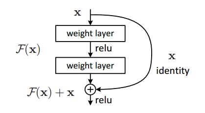

这样在 BP 过程中，求偏导如下：

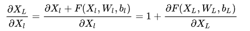

这样，哪怕随着层数的增加，梯度也不会消失。

#### 图像高分辨率重建

在单图高分辨率重建中，从一个低分辨率的输入，去产生一个高分辨率的输出图片。在广泛采用 CNN 以前，重建技术一般基于预测，基于边缘，统计方法，基于块，稀疏字典等方法。

## 3. 方法

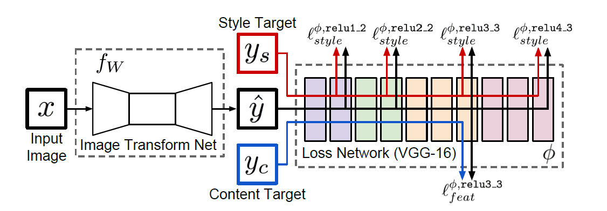

网络由左边的转换网络(Transform Net) 和右边的损失网络(Loss Net) 组成。转换网络为权重参数为 W 的深度残差网络，它将输入图片 x 映射成 `hat_y = fW(x) ` 。损失网络利用预训练好的 VGG-16 的模型来感知损失，每个子损失函数衡量的是该层特征与转换网络输出的差别。最后，转换网络的训练，采用 sgd 去优化：

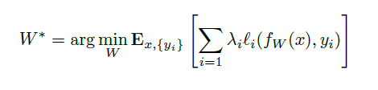

损失网络上下区域分别为感知风格和内容的损失。对于风格迁移，内容目标 yc 为输入图像 x，对于高分辨率 重建，则风格目标 ys 为输入图像 x。相当于说，一个风格目标，或一个分辨率因子，都需要为之训练一个转换网络。

这里，相较 Neural Style 方法中计算 Loss_content 和 Loss_style 网络中参数不断更新（疑问：Neural Style 方法中，这两个网络参数更新了？），不同的是，本文的 Loss Network 只用来感知损失，然后通过得到的损失，去更新转换网络 Transform Net 的参数。

### 3.1 图像转换网络

转换网络中，本文不采用任何池化层，取而代之的是，步幅或微步幅卷积核做上下采样。该网络由如下的五个残缺块(residual blocks)组成，并且输出层前的 ReLU 用一个 scaled tanh 代替，确保输出值在 [0, 255] 范围内。除了头尾两个卷积核采用 9x9，其余采用 3x3 大小。

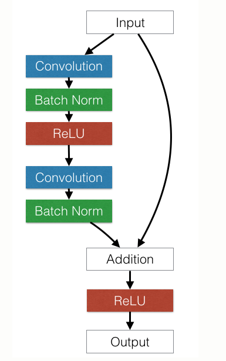

#### 输入输出

* 对于风格迁移，输入输出图片大小不变。
* 对于高分辨率重建，根据上采因子，输出 3 x 288 x 288，则输入为 3 x 288/f x 288/f。

#### 上下采样

* 对于风格迁移，该网络采用步幅为 2 的卷积进行下采样，紧跟着是几个残差块，接着利用两个步幅为 1/2 进行上采样。这样，保持输入输出大小不变，却降低了计算复杂度，增大有效感受野。
* 对于高分辨率重建，根据上采因子 f，在数个残差块后放置了 log_2 f 个步幅为 1/2 的卷积层。

### 3.2 感受损失网络

损失网络中，采用的是 VGG-16 模型，并利用 Imagenet 的数据进行预训练。本文定义了两个感知损失函数，分别衡量风格和内容的差别。

#### 内容损失

第 j 层内容感知损失如下， hat_y 为转换网络输出图像， y 则为目标内容图像。

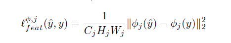

如果采用较低层特征衡量损失，往往产生与原图 y 不太能区分的图像。如果用高层来重建，内容和卷据结构会被保留住，但是颜色纹理和精确的形状不复存在。

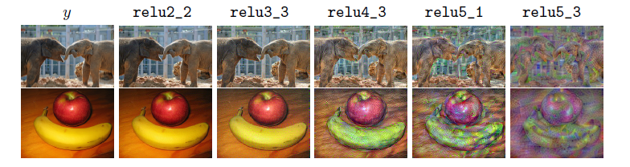

#### 风格损失

跟 Neural Style 一样，采用格兰姆矩阵：

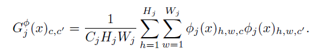

最后生成一张图片 hat_y 使得风格损失不停缩小，从而保存了风格上的特征，而不是保存空间上的结构特征。

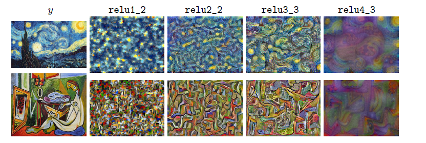

### 3.3 简单损失函数

除了上面两种感知损失，本文对低维像素信息定义了两种损失函数。

* 像素损失，输出图和目标图之间标准化差距，这只能用在具有完全确定的目标，让这个网络去完全匹配。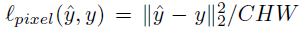
* 全变分正则化，为了使生成图像更加平滑，本文采用了全变分正则化 `Loss_TV(hat_y)`。

## 4. 实验

#### 4.1 风格迁移

以下是对不同分辨率输入图像进行风格迁移，蓝色 [10] 代表 [Neural Style](https://arxiv.org/abs/1508.06576) 论文提出的方法。

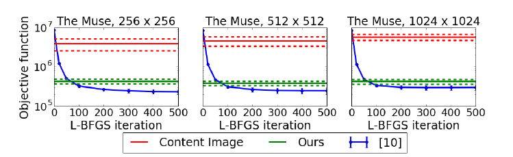

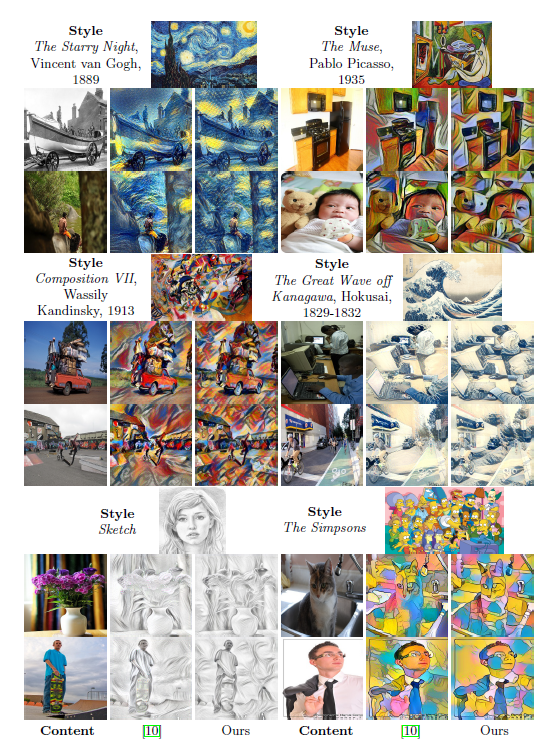

上面实验证明，本文方法同 Neural Style 一文的方法质量相齐。

本文模型用 256 x 256 的图片训练的，以下将其运用在 512 x 512 图像中，进行风格迁移。

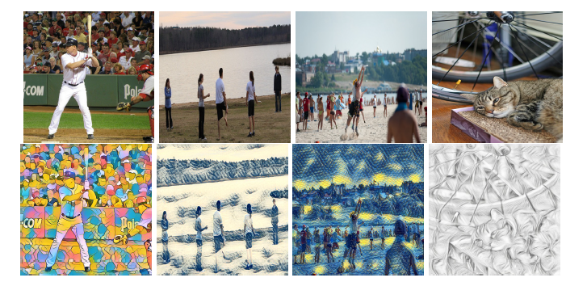

通过这些结果，可以明确的是，转换网络能意识到图像的语义内容。比如上图的图 7 海滩图像，人们明显被识别了出来，背景被风格扭曲。同样，图 8 的猫脸同样被识别了出来，但身体没有。这是因为 VGG-16 网络被训练来分类的，所以对图片的主体识别相较背景要完整得多。

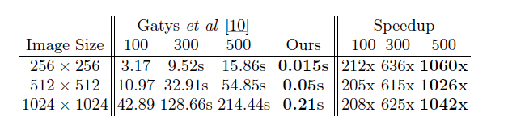

从上面实验数据中，可以发现，本文的方法相较 Neural Style 一文方法块了三个数量级。

### 4.2 高分辨率重建

高分辨率重建，这是一个固有的病态问题，因为对一个低分辨率图像，有可能对应着多种高分辨率图像。为了解决这个问题，我们训练的损失网络（右边部分），以保证语义信息可以从预训练好的损失网络中转移到高分辨率网络。

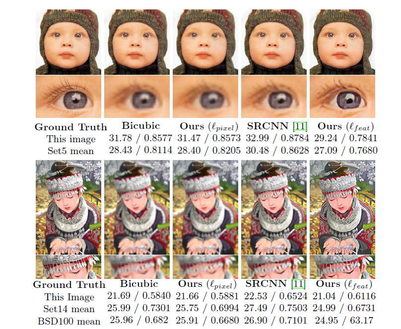

实验证明，本文方法取得了很好的效果，尤其在锋锐的边缘和好的细节。

## 5. 结论

优点：

- 生成速度快。
- 训练好的生成网络模型文件不大，载入简单。不需要VGG网络。

缺点：

- 训练速度很慢。官方推荐用coco数据集训练深度残差网络，这个数据集小的也有13GB，运行要几十个小时。
- 一个生成网络只能生成一种风格化图像。我们训练生成网络，使用的风格化图像只能用一种。

## 参考

* [[译] Perceptual Losses for Real-Time Style Transfer and Super-Resolution（Stanford University）](http://www.jianshu.com/p/b728752a70e9)
* [机器学习进阶笔记之六 | 深入理解Fast Neural Style](https://zhuanlan.zhihu.com/p/23651687?utm_source=tuicool&utm_medium=referral)

