# Real-Time User-Guided Image Colorization with Learned Deep Priors

[Real-Time User-Guided Image Colorization with Learned Deep Priors - 2017 SIGGRAPH](https://richzhang.github.io/ideepcolor/)

## 摘要

作者提出了一个用户导向的图像着色深度学习方法。该系统将灰度图像，结合稀疏的用户 "hints"，利用 CNN 输出着色图像。

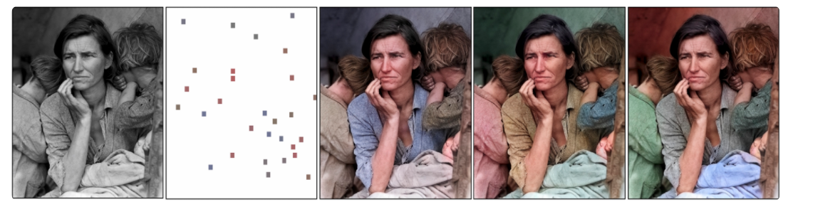

## 方法

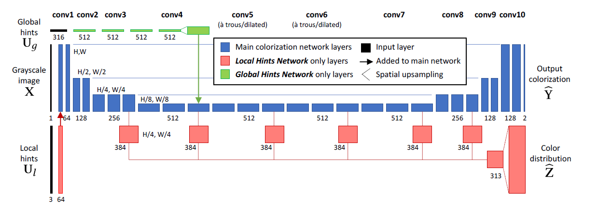

### 损失函数

本文训练了两个变量，local user hints U_l，和 global user hints U_g，训练过程中，将 ground truth color 进行投影，或 "give a peek"，分别经过 P_l 和 P_g 函数变换所得：

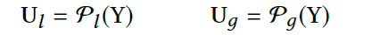

该模型采用了 Huber Loss （胡贝尔损失函数）：

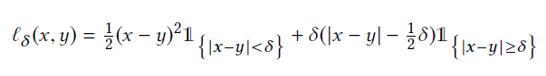

将与 groud truth 的各个像素损失叠加，最后得到：

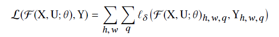

### Local Hints Network

图像局部信息，主要为用户输入的颜色信息块，如下图左。

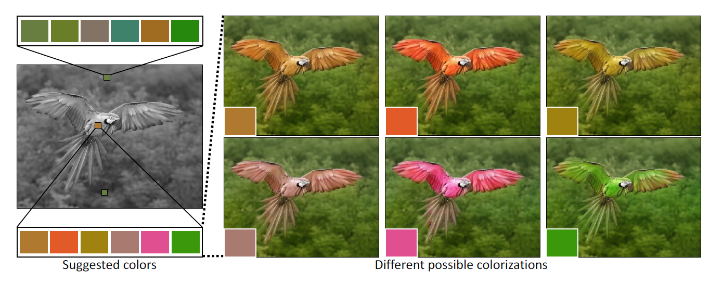

因此，局部信息网络的输入，由带 ab 颜色通道的 X 和 一个二元 mask 组成。该二元 mask 用来区分是否为用户定义点，当然，非用户定义点自然 (a, b) = 0。

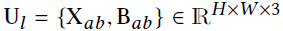

**[不理解]!**

> 训练该部分网络，收集带用户交互信息的颜色图像是个重大难题。作者通过随机采样（randomly sampling），对综合生成的用户交互信息进行训练，以此避开该难题。作者随机采样出一些 patch 小块，并且揭示这些块的平均颜色反馈给网络。每张图像，点的绘制服从几何分布，p = 1/8，每个点的位置根据二维高斯，

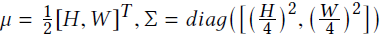

> 进行取值，patch size 块大小统一从 1x1 到 9x9。

沿用作者 [2016 - Colorful Image Colorization]() 的作法，采用 CIE Lab 颜色空间，将 ab 颜色通道划分成 10 x 10 的区段，总共有 Q = 313 个色域，颜色分布的 groud truth Z 根据软编码规则从 图像 ground truth Y 获得。本文采用交叉熵损失函数衡量颜色预测 hat_Z 的效果：

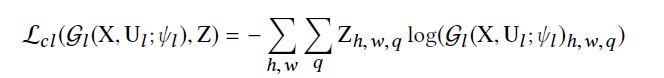

### Global Hints Network

图像全局信息，由图像直方图和平均图像饱和度（HSV 颜色空间模式的饱和度 S）构成。

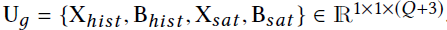

全局直方图的计算，通过将 ground truth 颜色图像 Y 使用双线性插值法缩放到 1/4 ，之后将每个像素编码成 ab 颜色空间，并平滑空间。而饱和度的计算，则由 ground truth 颜色图像 Y 转化为 HSV 颜色空间模式，然后对 S 通道空间取平均。在训练过程中，随机选择 reveal 与否 ground truth 的颜色分布和饱和度，两者选择必须相同。

### 网络结构

**Main Network**，采用的是 U 型网络结构，该网络已证明对于一系列 conditional generation tasks 有良好效果。该网络由 10 个卷积块组成，在 conv 1-4 里，每个块都包含由 2-3 个 conv-relu 卷积激活对。conv 7-10 则是分辨率恢复。该模型还设置了快捷连接，帮助网络信息恢复。比如 conv2 和 conv3 分别连接至 conv8 和conv9，使得网络更容易获得低层特征。卷积皆采用 3x3 的卷积核，并且跟随 BathNorm。

conv1-8 采用作者 [2016 - Colorful Image Colorization]() 预训练好的模型参数进行微调，conv9-10 以及快捷连接利用 scratch 进行训练。最后，利用一个 1x1 的卷积核，将 conv10 所得结果映射到输出颜色。由于 ab 通道色域进行了束缚，所以最后加了个 tanh 层处理输出。

**Local Hints Network**，颜色分布的预测需要结合主网络的着色，因此，作者采用了 hypercolumn 超级柱方法，从主网络各层提取特征，连接到一个两层的分类器。该网络 bp 时梯度不传进主网络。为了节省计算量，作者在 1/4 分辨率时进行颜色分布预测，并且采用双线插值向上采样进行分辨率恢复。

**Global Hints Network**，因为该网络输入没有 spatial information，所以作者将该部分信息融合进主网络 Main Network。由 4 个 512 通道数的 1x1 卷积核组成，最后通过 spatial upsampling 上采样融合进主网络。

## 实验

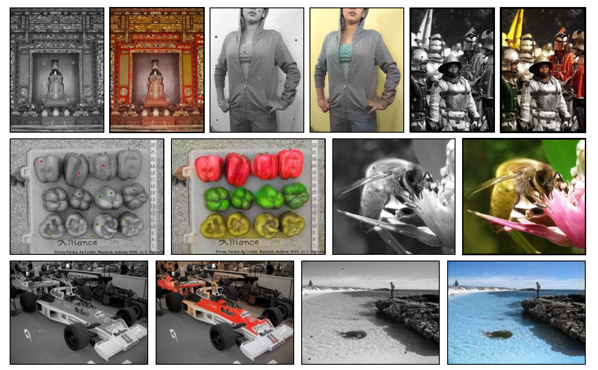

通过 Global Hints Network，根据输入的全局直方图进行着色：

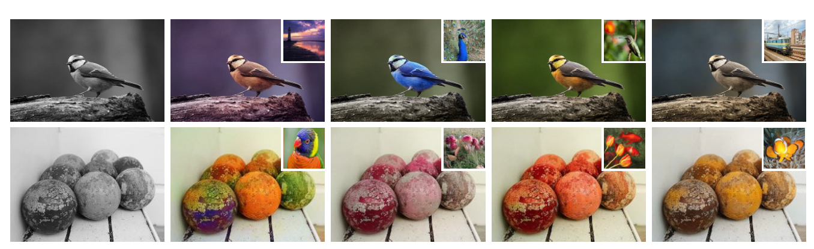

对于老照片的效果：

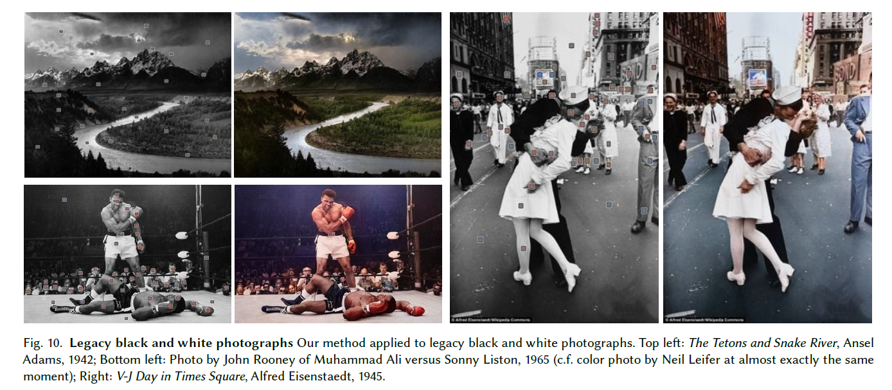

