# Image Style Transfer Using Convolutional Neural Networks

论文：

[A Neural Algorithm of Artistic Style - CVPR 2015](https://arxiv.org/abs/1508.06576)

[Image Style Transfer Using Convolutional Neural Networks - CVPR 2016](https://www.cv-foundation.org/openaccess/content_cvpr_2016/papers/Gatys_Image_Style_Transfer_CVPR_2016_paper.pdf)

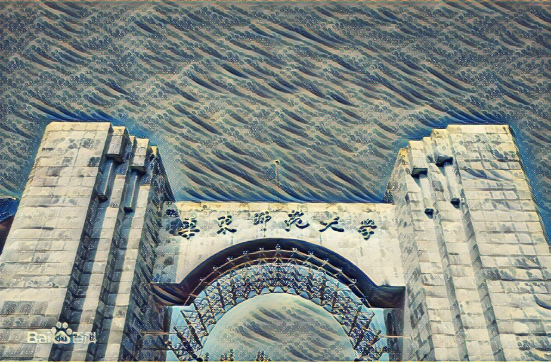

## 1. 摘要

风格迁移可以当成纹理迁移问题。纹理迁移问题在之前采用的是一些非参方法，通过一些专有的固定方法来渲染。这些传统方法的问题在于只能提取底层特征而非高层抽象特征。随着 CNN 的日渐成熟，从原始图片中，将内容和风格分离仍然十分困难，但是我们可以使用 CNN 对输入图片的高层抽象特征进行提取，学习。

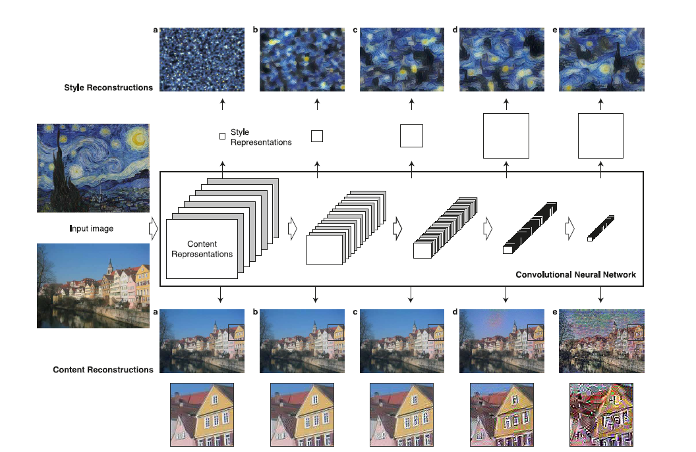

不考虑风格迁移，我们从上图中可以发现。

上方区域为风格特征提取，随着层数增加，所提取的风格就越粗粒度化。

下方区域为内容特征提取，随着层数增加，所提取的内容就越粗糙，越容易变形。（一定程度上更具绘画特征）

## 2. 方法

### 2.1 内容特征表达

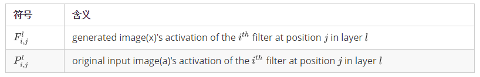

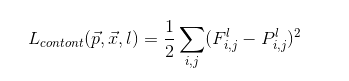

经过 ReLU 激活，求导得到下式：

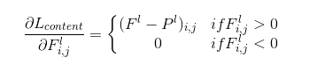

### 2.2 风格特征表达

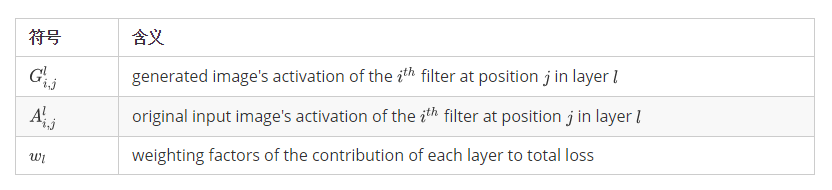

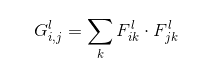

在 feature map 中，每个数字都代表了某个卷积核在特定位置的卷积，因此每个数字就代表一个特征强度。而格兰姆矩阵 G 计算的实际上是两两特征之间的相关性。它的对角线为同一个维度的值，使得原来特征强度如强则更强，如弱则更弱。而其它位置则代表不同维度特征之间的特征。

第 l 层的损失函数为：

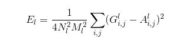

那么风格总损失函数为：

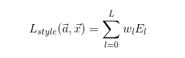

各层通过激活后对应的导数：

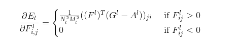

### 2.3 风格迁移

内容和风格总和损失函数为：

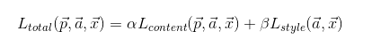

alpha 和 beta 分别为各自的权重。

这里总损失函数对 x 的求导可以使用数值优化策略，本文使用的是 `L-BFGS` 。

> L-BFGS 即 Limited-memory BFGS
>
> 使用有限的内存进行非线性方程优化问题。

另外，本文通常将 `content 图片` 和 `style 图片` 调整为同样大小。

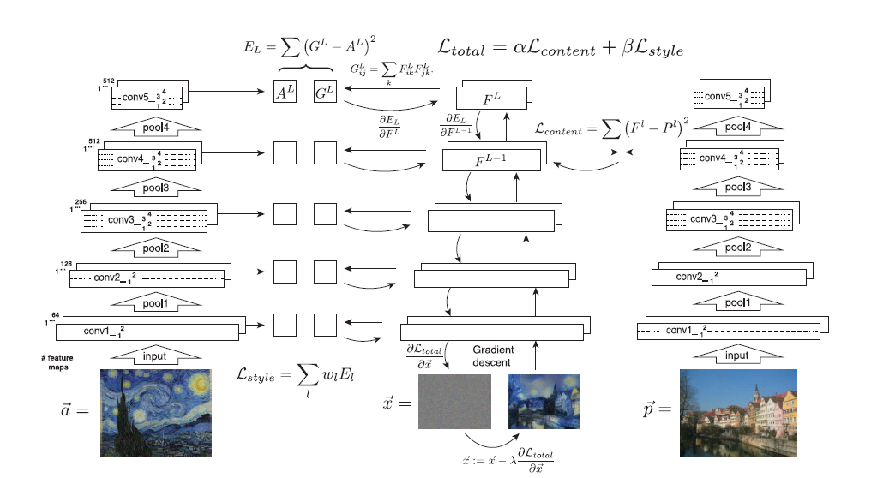

左中右三个网络皆采用VGG19（不使用3层全连接层，共16层卷积层）的相同模型。a 为风格图，p 为内容图，x 为白噪声图片，通过 N_iterations 次迭代，x 逐渐学习到 a 的风格纹理，和 p 的内容。

> VGG NET 模型：
>
> 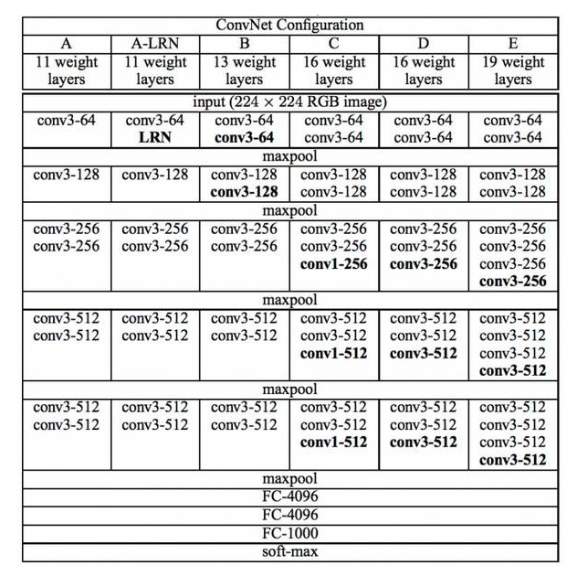

## 3. 实验

效果图：

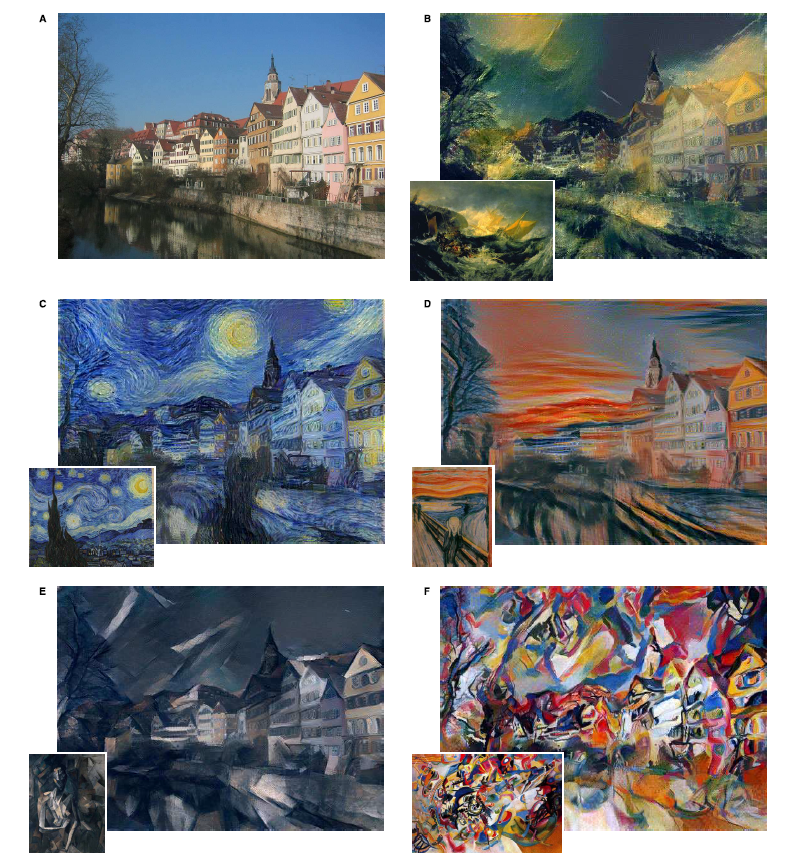

### 3.1 loss 权重比

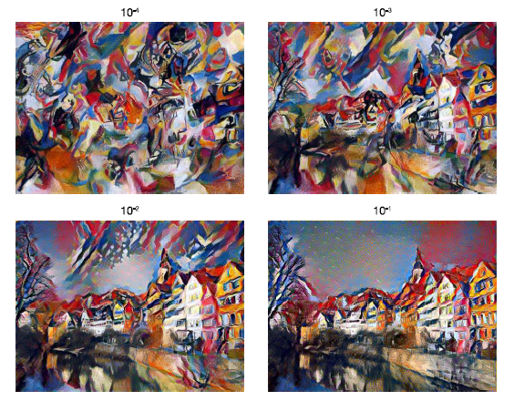

上方数值为 alpha / beta，不同权重比形成的图像。

### 3.2 层级选择

层级的选择越高，内容越粗糙变形。

### 3.3 初始化方法选择

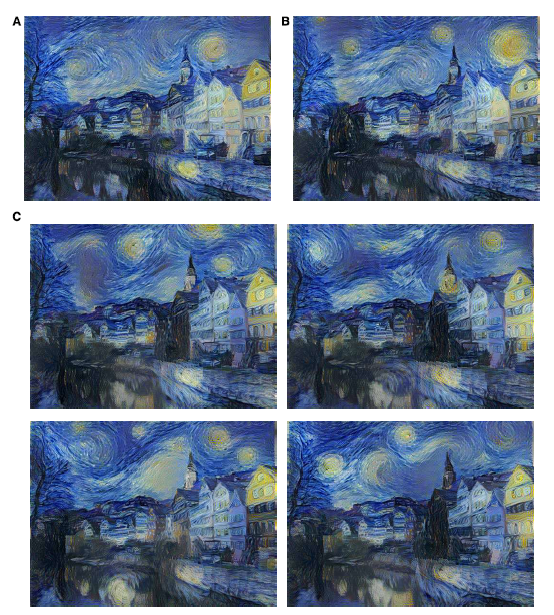

A 以内容图片作为初始化

B 以风格图片作为初始化

C 以不同的随机白噪声图片作为初始化

可以看到，不同的初始化方法，所得结果差别不大。

## 4. 讨论

* 速度慢，因为图片的生成需要迭代求导很多遍。
* 会引入噪声，这问题在风格迁移上不明显，若输入两张图片都是照片，噪声尤为明显。但这个问题估计可以很容易得到解决。
* 风格迁移的边界非常不明显，人类无法量化一张图片中哪一些属于风格，哪一些属于内容。
* 风格迁移的成功为生物学中人类视觉原理的研究提供了一条可以切入的点。