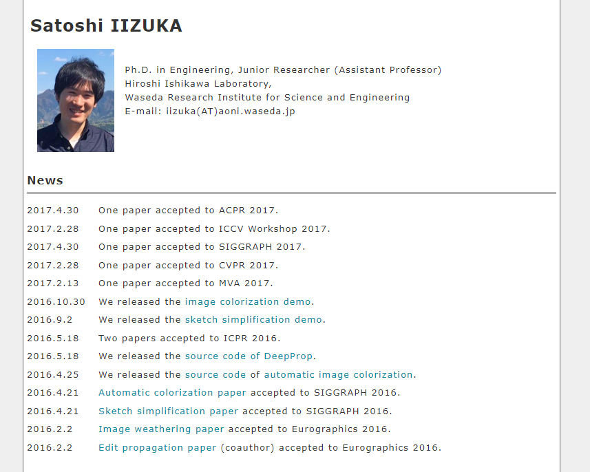
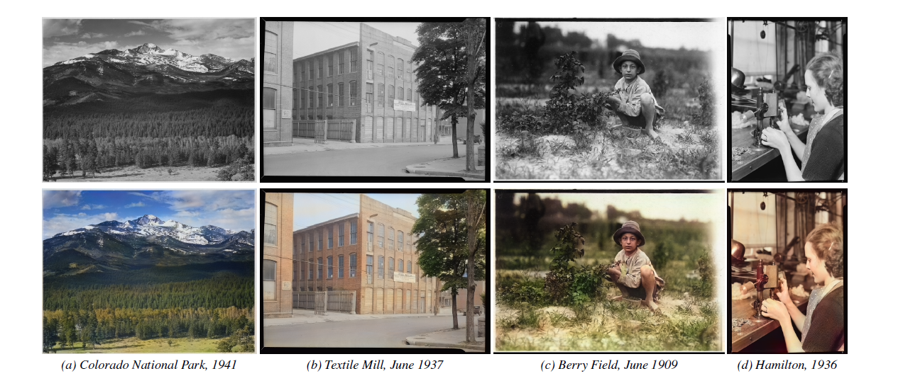
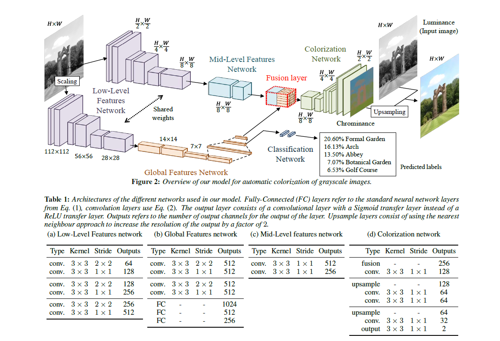
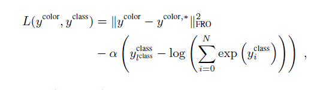
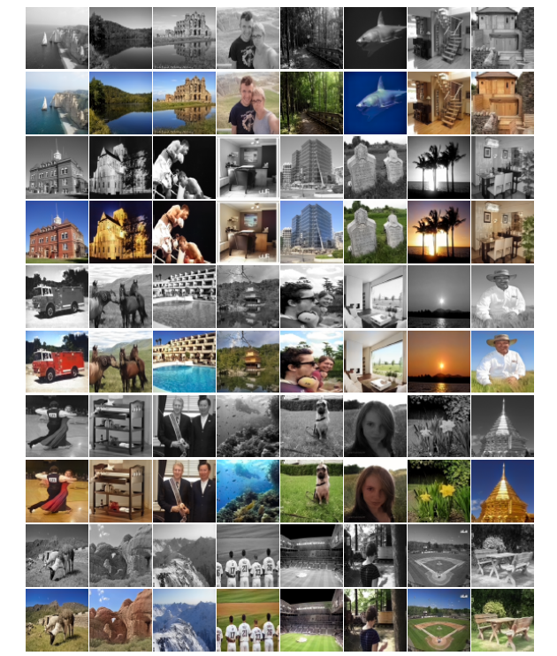
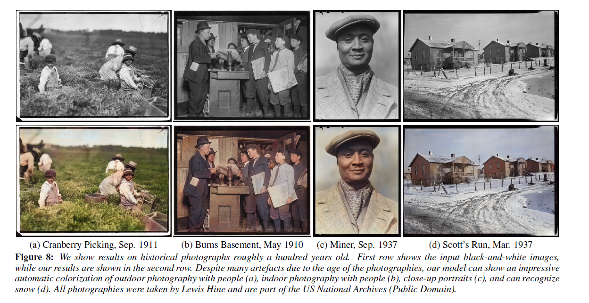
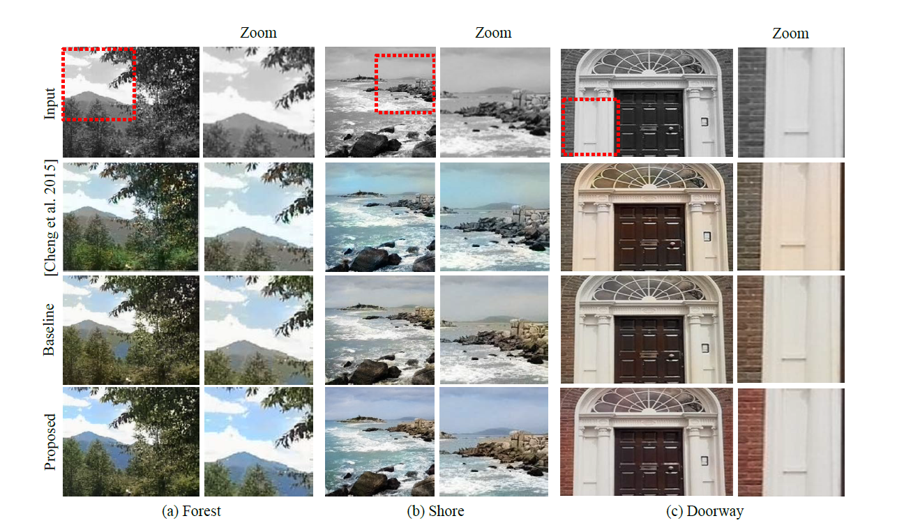
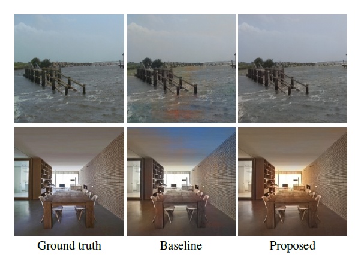
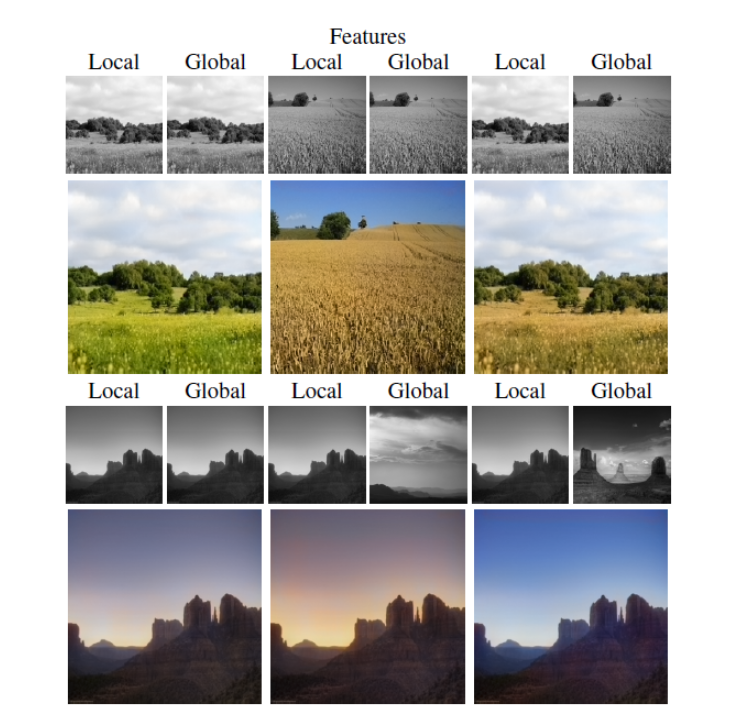

# Let there be Color!: Joint End-to-end Learning of Global and Local Image Priors for Automatic Image Colorization with Simultaneous Classification

论文主页：

[Let there be Color - SIGGRAPH 2016](http://hi.cs.waseda.ac.jp/~iizuka/projects/colorization/en/)

作者是来自Waseda University（早稻田大学）的 Satoshi Iizuka 、 Edgar Simo-Serra 、 Hiroshi Ishikawa。

作者SIG 2017 的论文，图像补全预测：

[Globally and Locally Consistent Image Completion - SIGGRAPH 2017](http://hi.cs.waseda.ac.jp/~iizuka/projects/completion/en/)

## 1. 摘要

作者提出了一个基于 CNN，结合全局先验和局部图像特征，进行灰度图像颜色预测的方法。传统的 colorization 着色算法需要用户的交互，图像分割等手段，而这篇基于深度学习，以数据驱动，可以完成端到端的自动上色。

## 2. 方法

作者提出了一个新的方法将全局和局部的特征进行融合。全局特征作为图像先验，指示局部特征输入图像的类别。比如，全局特征表明这是张室内图像，那么局部特征将不会偏向于添加天空颜色或者绿草颜色，而是尝试添加合适的家具颜色。

作者设计的模型基于 CNN，由数个直接无环图组成。主要划分为四个部分：low-level features network 低级特征网络，mid-level feature network 中级特征网络，global features network 全局特征网络，和 colorization network 着色网络。

### 2.1 低级特征网络

两边都是由六层的卷积神经网络组成，它们参数共享，并且使用 stride = 2 代替 max pooling 最大池化层，该做法越来越流行。

两边不同的是，接中级特征网络的一边，由于要处理不同大小分辨率的图像，所以网络大小不固定。而接全局特征网络的一边，由于全局特征网络的全连接层，所以需要固定大小。

### 2.2 中级特征网络

由两层卷积层组成，将低级特征网络的输出转化为 256 向量与全局特征网络进行融合。

 ### 2.3 全局特征网络

在全局特征网络中全连接的第二层，连接了一个 classfication network 分类网络，利用交叉熵损失函数，使用 Places Scene Dataset（共2448872张，205种类别）完成语义分析的训练。

最后输出一个256维的向量，与中级特征网络融合构成 Fusion Layer 融合层。

### 2.4 融合层

融合公式如下， u, v 为坐标，W 为 256 行 512 列的变换矩阵， b 为偏置向量，这两者皆为网络可学习部分。

### 2.5 着色网络

着色网络由卷积层和向上采样层组成，向上采样采用 nearest neighbor 最近邻技术，卷积层和向上采样层交叉，如此循环，直到输出为原图像的一半大小。输出层由一个带 Sigmoid 激励函数的卷积层构成，输出原始灰度图的色度。最后，将色度与输入的亮度图结合，生成最后的彩色图像。

### 2.6 损失函数

作者实验，就仅以最终彩色图像与 Ground truth 的误差作损失函数，取得的效果并不佳。因此，作者设计了以下损失函数。

该损失函数，分有着色预测损失部分 y^color 和分类损失 y^class 部分。着色预测损失为预测的彩色图像与 Ground truth 之间的 Frobenius 范式，也就是 L2 范式。alpha 为权重，当 0 时去除分类损失函数的考虑。l^class 为正确的图像分类标签，N 为分类总数，因此分类损失部分采用的是 cross-entroy 交叉熵损失函数。

### 2.7 训练优化

该神经网络虽然可以处理任何分辨率图像，可是对224 * 224图像最具效率，因为接全局特征网络的低级特征网络的大小是固定，若输入图像为224*224，那么低级特征网络的两部分大小则完全一致，那么两个子网络的输出皆可共享。

另外，作者还使用了 batch normalization 进行加速收敛。

使用 SGD 来优化深度网络十分普遍，但是，它十分依赖于一个全局的学习率，并且这个学习率要随着模型的学习逐渐下降调整。因此，作者使用了 ADADELTA optimizer，可以对网络进行学习率自适应，而无需我们设置一个全局学习率。

## 3. 实验

作者以 alpha = 1/300 ，在 2448872 张训练集图像，20500 张验证集图像，bath size 为 128， 大约200000 次迭代， 11 个 epoch，在 NVIDIA Tesla K80 GPU 上训练了约三个礼拜。

至于计算，作者以 NVIDIA GeForce GTX TITAN X GPU 进行计算，接近实时。

对百年前的照片进行颜色预测。

下面为与其它方法的比较，Baseline 为损失函数中 alpha 为 0 的结果，即抛弃全局特征的融合。

可以看到，上图的 Baseline 方法中把天花板当成了天空，因此错误地预测出了天空颜色。

## 4. 风格迁移

由于低级特征网络其中固定大小的部分，连接了全局特征网络进行内容语义分析，所以，当低级特征网络两部分的输入图像不相同时，接全局特征网络的图像风格会影响到接中级特征网络部分的图像上。

