# Learning a Deep Convolutional Network for Image Super-Resolution

作者来自香港中文大学的 Chao Dong 等人，以及来自微软研院的 Kaiming He。

论文地址：

[2014 ECCV - SRCNN - PDF](http://personal.ie.cuhk.edu.hk/~ccloy/files/eccv_2014_deepresolution.pdf)

[2015 TPAMI - SRCNN -PDF](http://ieeexplore.ieee.org/stamp/stamp.jsp?tp=&arnumber=7115171)

项目地址：

[project web](http://mmlab.ie.cuhk.edu.hk/projects/SRCNN.html)

## 1. 摘要

本文提出了基于 CNN 完成超分辨率重建（Super-Resolution, SR）的端到端的方法，过程类比于基于稀疏编码（sparse-coding）的 SR 方法，不同的是，网络参数的统一更新有别于传统方法学习过程中的各步骤分开训练。

## 2. 方法

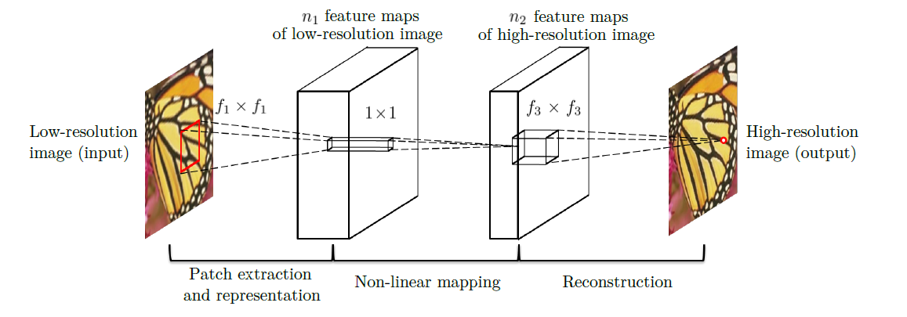

网络模型如上，十分精简，如同基于稀疏编码的 SR 方法，构成网络的三层分别完成传统方法的三个步骤。以下为基于稀疏编码的 SR 方法：

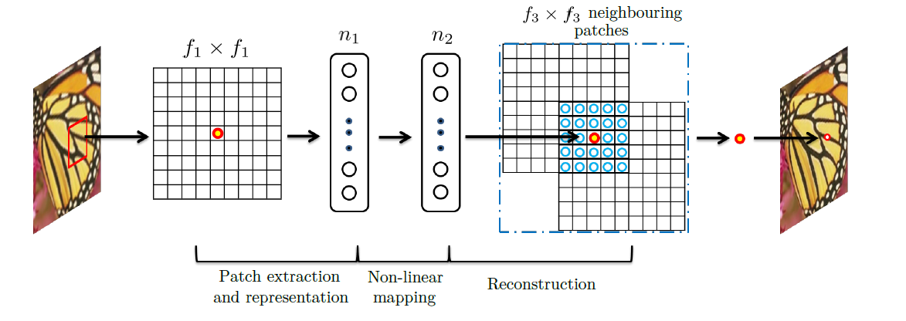

因此，算法如下：

**预处理**：

使用双三次插值法（bicubic interpolation）进行上采样，扩大若干倍大小。

**(a) Patch extraction and representation:**

基于稀疏编码的 SR 方法中，该步骤主要采用均值滤波提取 patch 块，并投影进低分辨率字典集中。

而本文采用卷积层进行代替，并利用 ReLU 增强非线性表达。

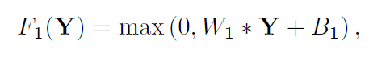

W1，也就是卷积核采用 c x f1 x f1 x n1，具体数值设置通过实验效果决定。

**（b)非线性映射：**

基于稀疏编码的 SR 方法中，该步骤通常采用 Feature-Sign solver 等方法，将 n1 coefficients 变换为 n2 coefficients，并且基于稀疏编码的 SR 方法中通常 n1 = n2。

而本文同样采用卷积层代替，利用 ReLU 激活。

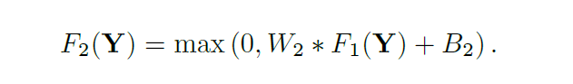

采用 1x1 大小的卷积核， n1 x  1 x 1 x n2。

**(c)重建：**

基于稀疏编码的 SR 方法中，该步骤为将 n2 coefficients 投影至同样经过均值滤波处理的高分辨率字典集。

相当于线性映射，因此本文采用卷积层代替，无激活函数。

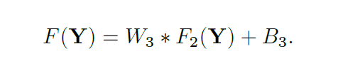

线性映射，采用卷积核大小为 n2 x f3 x f3 x c。

**损失函数：**

该网络模型的损失函数采用均方误差（mean squared error, MSE）：

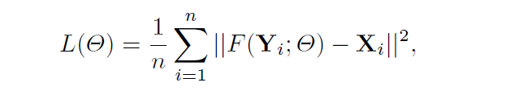

其中，n 为样本图像数量，Y 为输入的低分辨率图像， X 为高分辨率图像。

## 3. 实验

a typical setting : f1 = 9, f3 = 5, n1 = 64, n2 = 32 （n2 < n1，类比于基于稀疏编码的 SR 方法，给予超分辨率的中心部分 patch 快更高的影响权重）

###  3.1 卷积核大小设置

同样采用 3 倍上采样的预处理，在 Set5 数据集中，不同卷积核大小设置，实验如下：

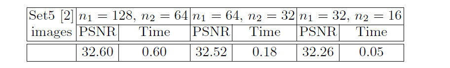

### 3.2 质量评估

具体实验统计如下：

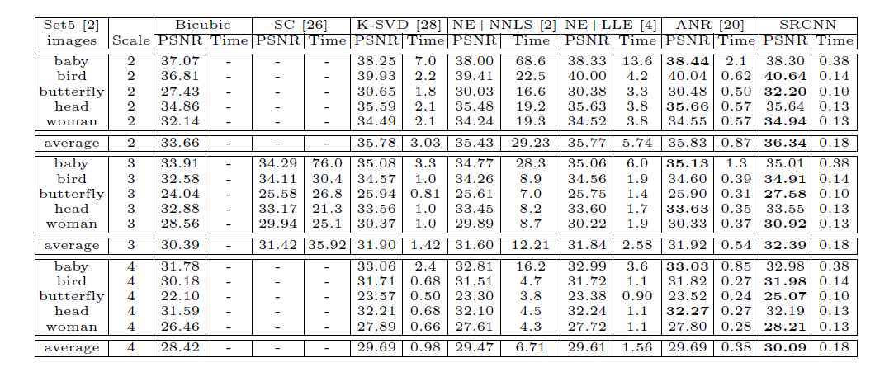

另一数据集下：

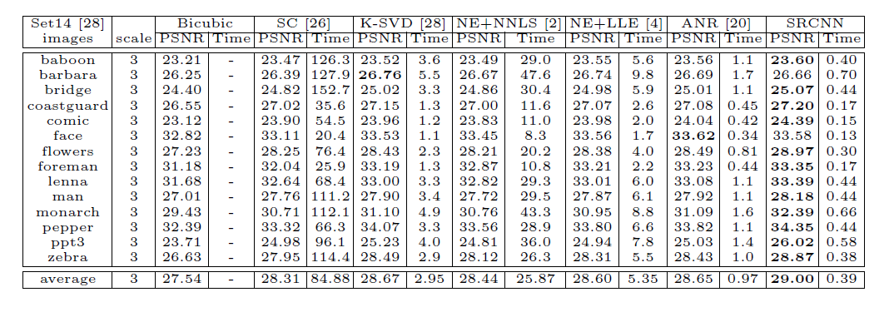

在 Imagenet 上的表现：

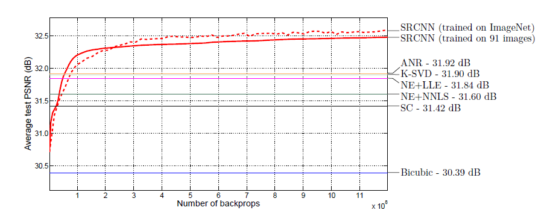

### 3.3 效率评估

至于效率上，作者给出的统计是，该方法又快又好：

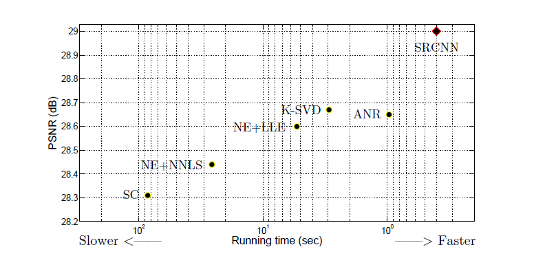

