# Visual Attribute Transfer through Deep Image Analogy

[Visual Attribute Transfer through Deep Image Analogy - 2017 SIGGRAPH](https://arxiv.org/abs/1705.01088)

## 1. 摘要

Style Transfer 风格迁移类的风格化技术（如 Nerual Transfer，Fast Neural Transfer 等），它们的风格化更多的是全局的”画风“ 迁移，没有考虑到局部内容的呼应。本文为了增加了图像语义信息的匹配，采用了 Image Analogy[Hertzmann et al. 2001] 与 CNN 相结合的方法。作者把这种方法叫 Deep Image Analogy。

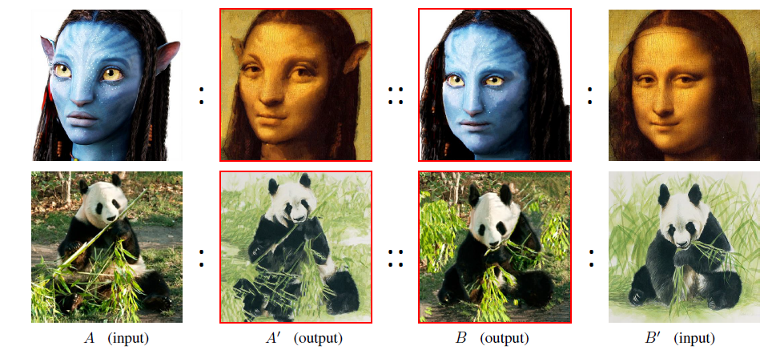

## 2. 方法

本文通过图像类比方法(Image Analogy) 结合 CNN 高层特征获得视觉属性迁移(Visual Attribute Transfer)。先利用预训练好的 CNN 模型，提取各层的特征 A/B‘。每一层，通过前向和反向 NNF(Nearest-neighbor Field) ，建立A 和 B，以及 A’ 和 B‘ 的特征映射关系。并用其来重建上一层的 A' 和 B。最后向上取样，作为上一层映射关系计算的初始值。这三步（NNF 搜索，A’ 和 B的重建，特征关系向上取样）在每一层不断重复，直到获得最低层的 A' 和 B。

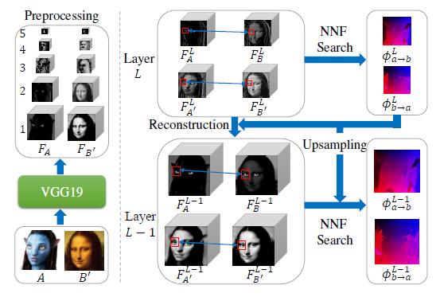

### 2.1 预处理

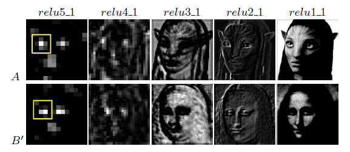

* 本文采用 VGG-19 模型，用 ImageNet 数据集进行预训练。本文的做法是，提取 A 和 B‘ 的 5 层特征。对应层如上图。
* 由于在最高层特征具有很强的相似性，因此，本文令

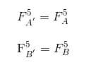

### 2.2 最近邻搜索（Nearest-neighbor Field Search） 

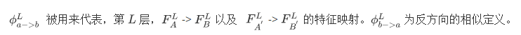

具体定义如下：

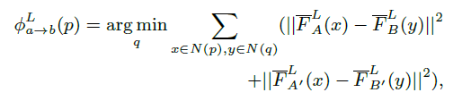

当 `L = 1，2` 时， patch 的大小设置为 5x5，`L = 3，4，5` 时，patch 大小则设置为 3x3。 

式中特征向量采用以下形式标准化，因为在网络中相对值比绝对值更具有意义。

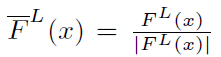

在上面特征映射关系式中，并不需要正则项，因为 PatchMach 方法中，patch 聚合带来的重叠隐含了局部的光滑。

从以上特征映射关系式中，我们可以看到有两个方向（A 到 B 和 A‘ 到 B’），可以简化成单方向 （A 到 B 或 A‘ 到 B），但是效果明显会大打折扣。如下图，(a) 为输入，(b) 为双向 + 解卷，(c) 为单向 + 解卷，(d) 为双向 + 重采样

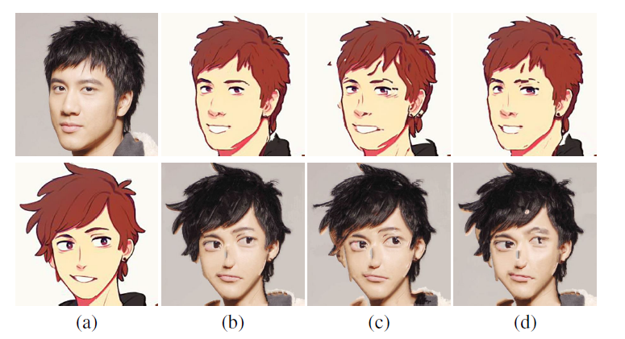

### 2.3 近似图像重建 (Latent Image Reconstruction)

综上，我们必须在每层进行 NNF 搜索前，重建 A‘ 和 B。因此有如下定义：

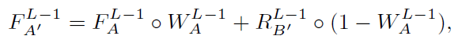

R 为本层 B 通过一定映射得到。那么，这里可能有人会疑问，R 为什么不能直接用上一层所得到的 Phi 结合本层的 A 直接转换求得？原因是，在 CNN 中两个邻层之间，由于通过非线性计算（比如，ReLU，Max-Pooling等），所以两层特征之间，包括所得到的 Phi 之间，是难以确切计算出来的，这也是后面为什么上下层的 Phi 并不能通过简单的上采样获得。

因此，针对此问题，本文提出了结合解卷的方式，获得 R。

该式可以表达为如下步骤：

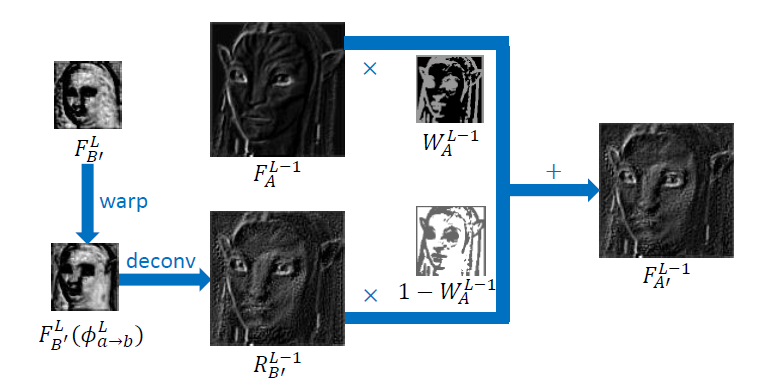

具体解卷方式，是在 L 层与 L - 1 层之间定义一个 CNN 子网，然后 R 随机初始化，作为该子网的输入。根据以下损失函数，求得的 R，使得损失函数最小，最后得到的 R 通过该 CNN 子网卷积后，与下一层对应通过 Phi 计算出来的特征十分逼近。

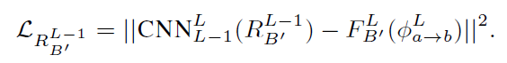

本文梯度下降采用的是 L-BFGS，采用的 CNN 子网模型同样为预训练好的 VGG-19 模型。

那么，重建公式中的权重 W 的定义如下：

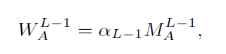

上式中的 M，为了保存 A 的结构，采用了 sigmoid 函数，定义如下：

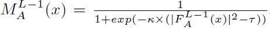

其中 `k = 300, tau = 0.05`, 并且本层的 `F_A(x)` 被标准化在 [0, 1] 区间。

上式的 alpha 为内容和风格(structure and feature)的比例，本文采用的比例为 `alpha_4,3,2,1 = {0.8, 0.7, 0.6, 0.1}` 。下面为 alpha 取不同值所得结果：

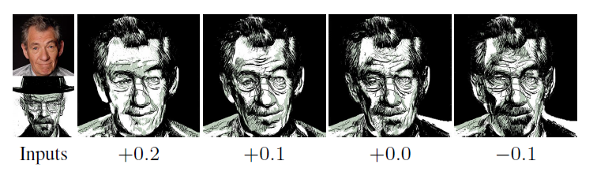

### 2.4 最近邻向上采样 (Nearest-neighbor Filed Upsampling)

由于本文通过 PatchMatch 来获得 NNF ，具有分段光滑性质(piece-wise smooth)。因此，本文采用最近邻插值(nearest-neighbor interpolation)来代替线性插值(linear interpolation)。因此，除了最顶层 L 层的 `Phi_a->b, Phi_b->a` 为随机初始化，其余层皆采用上一层所得 Phi 进行上采样作为初始值。

下面为结合上层所得 Phi 的上采样为初始值，以及各层的 Phi 之间相互独立所得到的效果图：

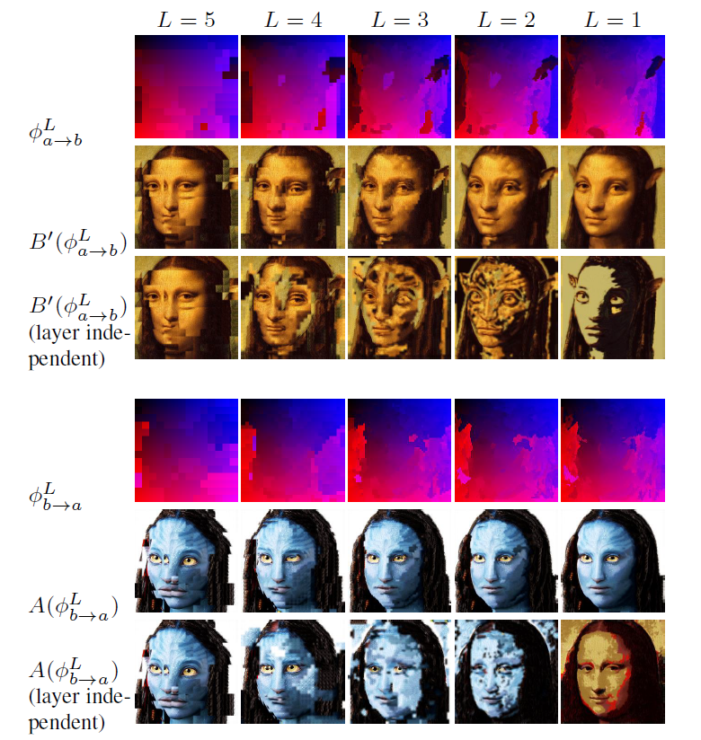

### 2.5 伪代码

综上，整个过程伪代码如下：

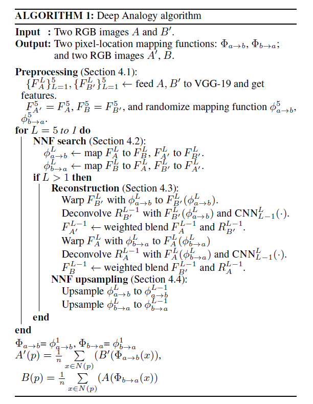

## 3. 效果

下面为效果对比图：

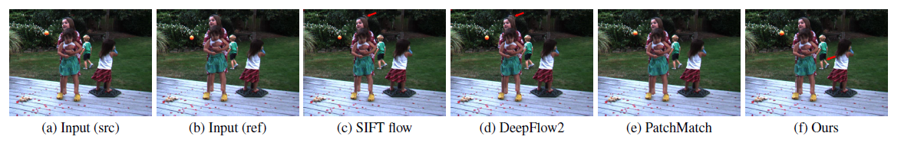

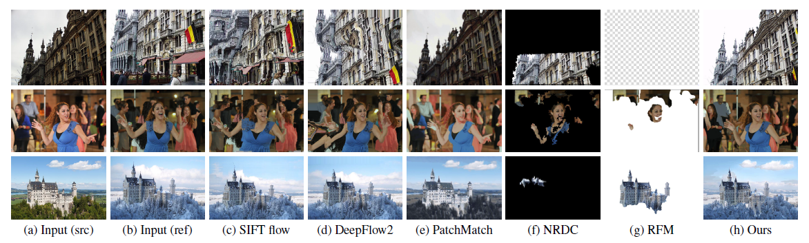

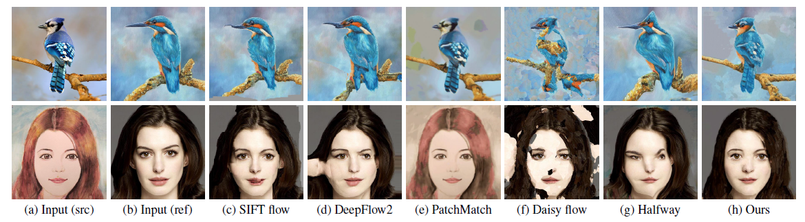

## 4. 应用

本文方法有以下四种应用：

* Photo to Style
* Style to Photo
* Style to Photo
* Photo to Photo

### 4.1 Photo to Style

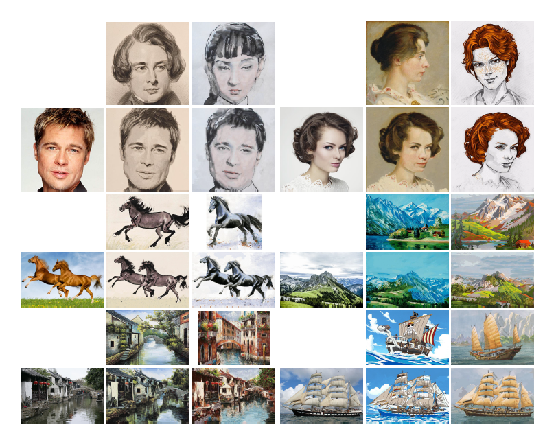

### 4.2 Style to Photo

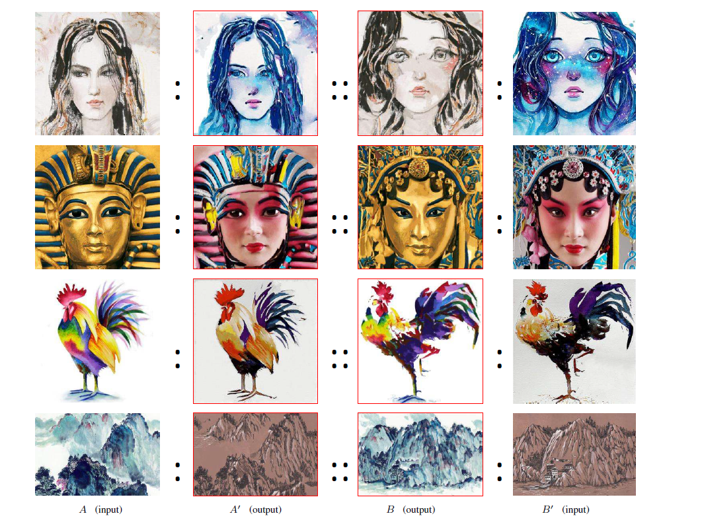

### 4.3 Style to Photo

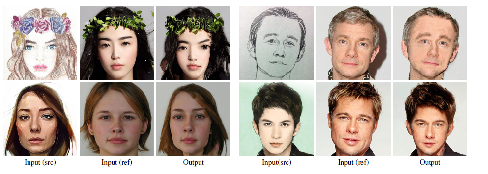

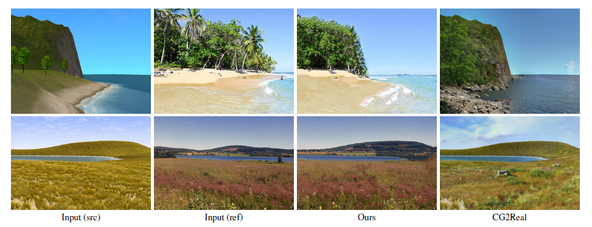

### 4.4 Photo to Photo

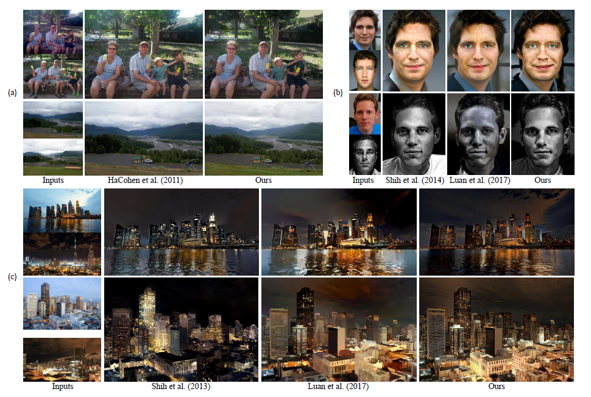

## 5. 讨论

缺点：

* 不对所有图像具有兼容性。由于依赖于 ImageNet 训练的 VGG-19 模型来提取特征，进行语义匹配，所以，对于不能正确语义分析的图像经常匹配错误。如下图左上部分。
* 对于需要将 Patches 信息进行伸缩变换的经常产生错误的匹配。如下图右上部分。
* 对于部分材质区域的网络激活所得值过低的图像（比如黑背景），可能产生错误。如下图右下部分。
* photo to style 的应用不能产生几何风格迁移。如下图左下部分。

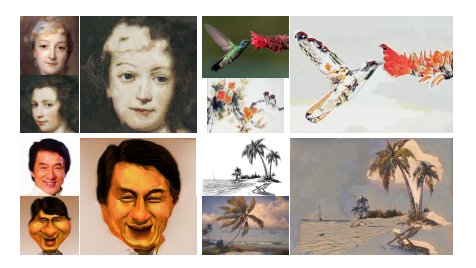