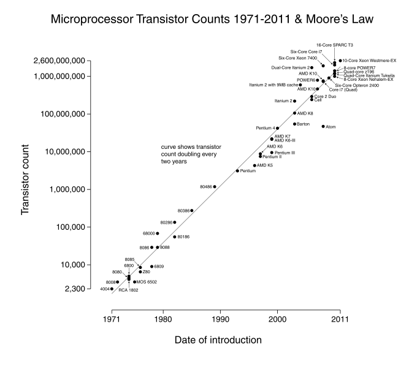
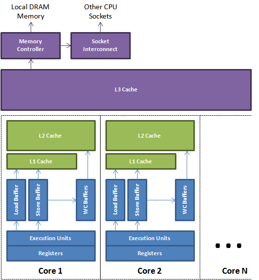
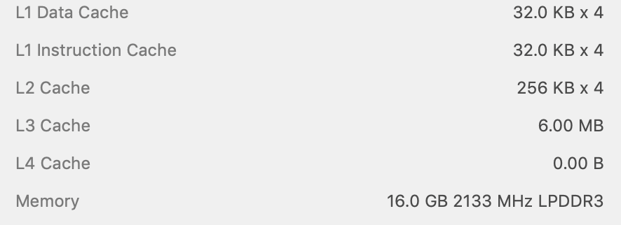
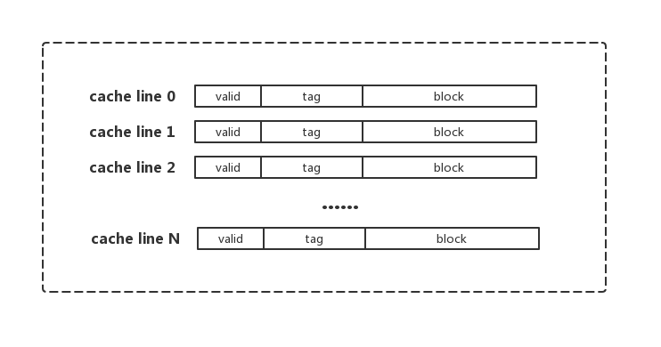

## 三级缓存

CPU的发展呈现出摩尔定律（近期越来越多的声音觉得结束了），发展速度迅猛，每18-24个月性能翻番。而内存的发展相较之下显得十分缓慢，与CPU的性能差距越来越大。为了缓冲两者的速度差，引入了采用SRAM做Cache的三级缓存(L1、L2、L3)，以提高CPU的计算效率。当然了，其实内存并非无法提速，只是出于成本和容量的平衡。

> 1965 年，英特尔联合创始人戈登·摩尔提出以自己名字命名的「摩尔定律」，意指集成电路上可容纳的元器件的数量每隔 18 至 24 个月就会增加一倍，性能也将提升一倍。

这就好像咱们去超市购物，所购买的东西经常就那么几样，真正购物的时间很短，但是交通耗时、买单排队耗时通常就已经占据了大部分的时间。出于成本考虑，一个小区配备一个超市显然不太可能。于是引入了住宅楼下的自动售卖机、社区的便利店等。如此一来，购物效率自然提高了。

三级缓存集成在CPU中，组成如下，每个CPU核都拥有自己的L1 Cache、L2 Cache，而L3 Cache为所有核心共享。其中，L1距离Execution Units计算单元距离最近，计算速度通常十分接近；L2 、L3分别次之。另外，L1 Cache 一般分为 L1d 数据缓存 和 L1i 指令集缓存，用以减少CPU多核心/多线程竞抢缓存引起的冲突。

读取数据时，逐级访问，即执行单元访问L1，若不存在该数据，则L1访问L2，L2若同样没有则访问L3，最后L3访问内存。

三级缓存的大小通常不大，以本机`i5-8259u`为例：

## Cache Line

一个Cache分为N个Cache Line, 一般大小为32byte或64byte，是和内存进行数据交换的最小单位。一个Cache Line 至少有valid、tag、block三个部分，其中block用以存储数据，tag用于指示内存地址，valid则用于表示该数据的有效性。

CPU内核访问数据时，发现该数据处于某个Cache Line中，且valid状态为有效，则成为cache hit，否则，成为cache miss。通常，缓存命中和未命中对于内核的效率影响相差几百个时钟。因此，为了缓存命中率，采用合理有效的缓存数据设置和替换策略对于CPU的计算效率至关重要。就好比社区便利店根据居民的购物习惯，提供高频消费的商品，并且，根据客户喜好的演变进行调整。

CPU的缓存数据设置主要根据空间局部性、时间局部性。

> 空间局部性：若一个存储位置的数据被访问，那么它附近位置的数据很大可能也会被访问。
>
> 时间局部性：若一个存储位置的数据被访问，那么它在将来的时间很大可能被重复访问。

而缓存置换策略一般有三种，FIFO 先进先出，LRU 最近最少使用，和 LFU 最不常使用：

> FIFO：First In First Out，根据进入缓存时间，淘汰最早的。
>
> LRU：Least Recently Used，对缓存数据进行使用量统计，淘汰最少使用的。该算法使用最多。
>
> LFU：Least Frequently Used，一段时间内，根据使用量，淘汰最少使用的。

（LUR和LFU算法练习：[Leetcode-LRU](https://leetcode-cn.com/problems/lru-cache/)、[Leetcode-LFU](https://leetcode-cn.com/problems/lfu-cache/)）

## 缓存一致性

引入缓存后，结合合理有效的缓存数据设置和替换策略，虽然大大提高了CPU的计算效率，但是同时也带来了缓存一致性问题。

