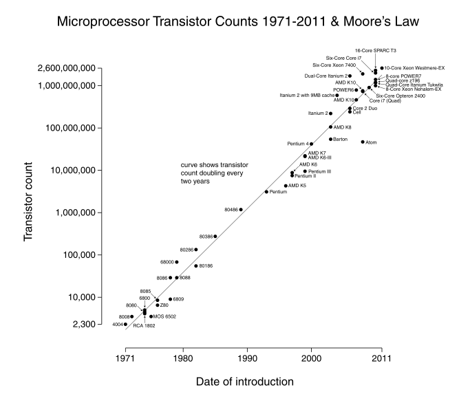
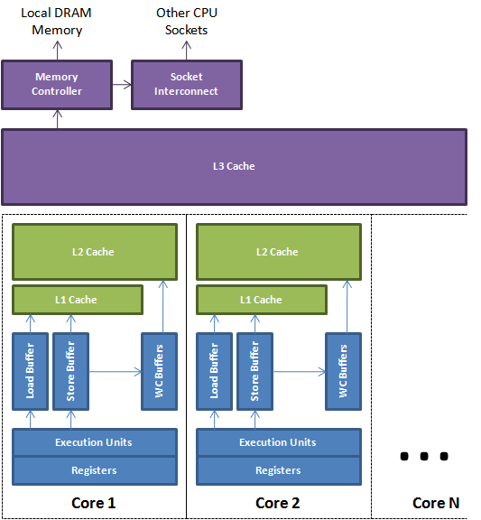
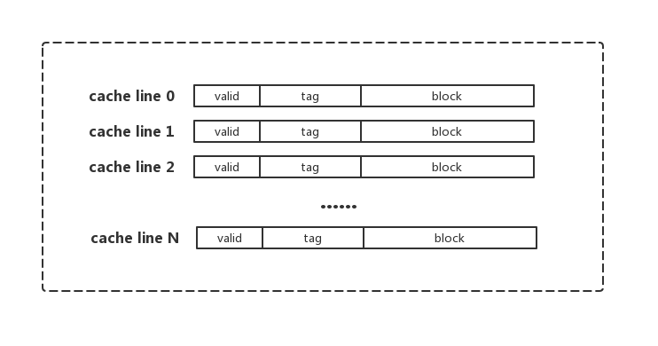
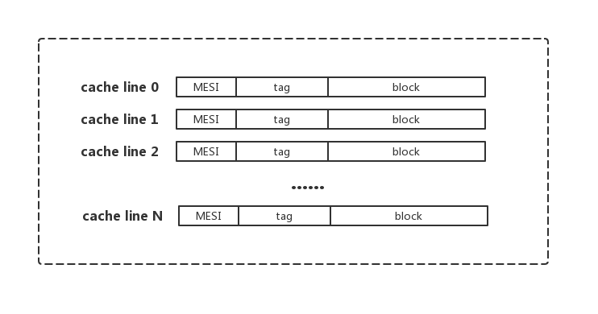
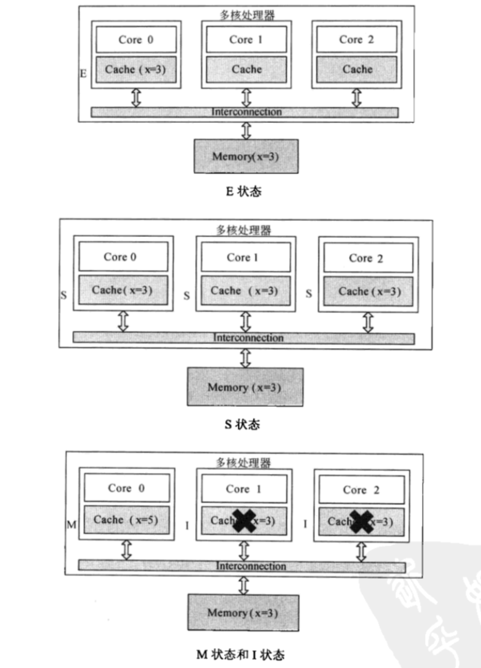
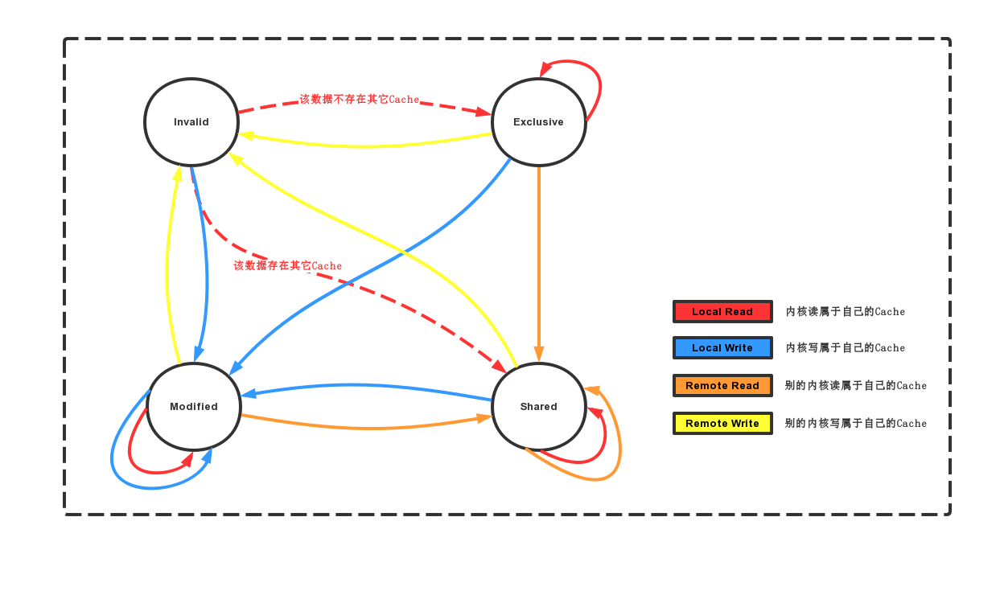

[TOC]

## 一、前言

原打算重新学习一下 `volatile` 的实现原理，其中涉及到指令调度重排和数据可见性保证，这两者的理解离不开对 CPU Cache的掌握，因此，先重温一下CPU Cache，便有了本文。

## 二、为何需要CPU Cache

CPU的发展呈现出摩尔定律（近期越来越多的声音觉得结束了），发展速度迅猛，每18-24个月性能翻番。而内存的发展相较之下显得十分缓慢，与CPU的性能差距越来越大。为了缓冲两者的速度差，引入了采用SRAM做Cache的三级缓存(L1、L2、L3)，以提高CPU的计算效率。当然了，其实内存并非无法提速，只是出于成本和容量的平衡。

> 1965 年，英特尔联合创始人戈登·摩尔提出以自己名字命名的「摩尔定律」，意指集成电路上可容纳的元器件的数量每隔 18 至 24 个月就会增加一倍，性能也将提升一倍。

这就好像咱们去超市购物，所购买的东西经常就那么几样，真正购物的时间很短，但是交通耗时、买单排队耗时通常就已经占据了大部分的时间。出于成本考虑，一个小区配备一个超市显然不太可能。于是引入了住宅楼下的自动售卖机、社区的便利店等。如此一来，购物效率自然提高了。

## 三、L1、L2 、L3 Cache 三级缓存结构

三级缓存集成在CPU中，组成如下，每个CPU核都拥有自己的L1 Cache、L2 Cache，而L3 Cache为所有核心共享。其中，L1距离Execution Units计算单元距离最近，计算速度通常十分接近；L2 、L3分别次之。另外，L1 Cache 一般分为 L1d 数据缓存 和 L1i 指令集缓存，用以减少CPU多核心/多线程竞抢缓存引起的冲突。

读取数据时，逐级访问，即执行单元访问L1，若不存在该数据，则L1访问L2，L2若同样没有则访问L3，最后L3访问内存。

三级缓存的大小通常不大，以本机`i5-8259u`为例：

> i5-8259u：
>
> L1 Data Cache ：32.0 KB x 4
>
> L1 Instruction Cache ：32.0 KB x 4
>
> L2 Cache ：246 KB x 4
>
> L3 Cache ：6.00 MB
>
> L4 Cache ：0.00 B
>
> Memory ：16.0 GB 2133MHz LPDDR3

## 四、Cache Line：与内存数据交换的最小单位

一个Cache分为N个Cache Line, 一般大小为32byte或64byte，是和内存进行数据交换的最小单位。一个Cache Line 至少有valid、tag、block三个部分，其中block用以存储数据，tag用于指示内存地址，valid则用于表示该数据的有效性。

CPU内核访问数据时，发现该数据处于某个Cache Line中，且valid状态为有效，则成为cache hit，否则，成为cache miss。通常，缓存命中和未命中对于内核的效率影响相差几百个时钟。因此，为了缓存命中率，采用合理有效的缓存数据设置和替换策略对于CPU的计算效率至关重要。就好比社区便利店根据居民的购物习惯，提供高频消费的商品，并且，根据客户喜好的演变进行调整。

CPU的缓存数据设置主要根据空间局部性、时间局部性。

> 空间局部性：若一个存储位置的数据被访问，那么它附近位置的数据很大可能也会被访问。
>
> 时间局部性：若一个存储位置的数据被访问，那么它在将来的时间很大可能被重复访问。

而缓存置换策略一般有三种，FIFO 先进先出，LRU 最近最少使用，和 LFU 最不常使用：

> FIFO：First In First Out，根据进入缓存时间，淘汰最早的。
>
> LRU：Least Recently Used，对缓存数据进行使用量统计，淘汰最少使用的。该算法使用最多。
>
> LFU：Least Frequently Used，一段时间内，根据使用量，淘汰最少使用的。

（LUR和LFU算法练习：[Leetcode-LRU](https://leetcode-cn.com/problems/lru-cache/)、[Leetcode-LFU](https://leetcode-cn.com/problems/lfu-cache/)）

## 五、MEIS：缓存一致性

引入多级缓存后，结合行之有效的数据设置和替换策略，大大提高了CPU的计算效率，但是同时也带来了缓存一致性问题。

### 5.1 底层操作

为了保证 Cache 一致性，CPU 底层提供了两种操作：Write invalidate 和 Write update。

> Write invalidate 操作指：当一个内核修改了一份数据，其它内核如果有这份数据，就把 valid 标识为无效。
>
> Write update 操作指：当一个内核修改了一份数据，其它内核如果有这份数据，就都更新为新值。

Write invalidate 操作实现起来更为简单，加上其它内核后续并不需要使用到改数据。缺点在于一个valid标识对应个Cache Line，如此一来，其它原本有效的数据也被设置为无效。Write update 操作会产生大量的更新操作，不过只需要更新修改的数据，而非一个Cache Line。大多数处理器采用的操作都是 Write invalide。

这两个操作也是我们码农常用的缓存操作，修改缓存数据后，将缓存置为无效，或者直接更新。当然，除此之外，对于实时性要求不高的缓存数据，我们还经常采用定期时间，自动过期的策略。

### 5.2 MESI 协议

Write invalidate 提供了缓存一致性的简单解决思路，具体的实施还需要一套完整的协议，其中比较经典，常作为教材的就是MESI协议，后续许多协议都是基于MESI进行扩展。

与前文讲到的 Cache Line 普通结构不同的是，MESI 协议中，Cache Line 用头两个 bit 来表示 MESI 的四个状态：

这四个状态分别为：

> M（Modified）：数据被修改了，属于有效状态，但是数据只处于本Cache，和内存不一致。
>
> E（Exclusive）：数据独占，属于有效状态，数据仅在本Cache，和内存一致。
>
> S（Shared）：数据非独占，属于有效状态，数据存于多个Cache，和内存一致。
>
> I（Invalid）：数据无效。

下面用画图示意四个状态，便于理解，图片取自《大话处理器》：

需要注意的是：当状态为E/S时，数据才与缓存一致。而修改某内核Cache的数据后，并不会立即写回内存，而是将该Cache Line标示为M，其它内核的该份数据表示为I，此时的数据是不一致的。

下面为四个状态的转化示意图：

从状态转化图中，可以注意到的是：无论当前Cache Line处于什么状态，对于两个修改操作——Local Write 将本Cache Line 状态变更为 Modified，并将其它Cache Line统一设置为 Invalid（若其它核处于S），等待触发写回内存；而 Remote Write 则将所有存有该份数据的 Cache Line 状态统一变更为 Invalid 失效，相当于重新构建该数据的缓存。

下面分别对四种状态的转化进行具体说明：

当状态为 Invalid 时：

| 当前状态 | 事件          | 下个状态  | 说明                                                         |
| -------- | ------------- | --------- | ------------------------------------------------------------ |
| Invalid  | Local Read    | Exclusive | 在其它Cache中找不到该数据                                    |
| Invalid  | Local Write   | Shared    | (1)若存有该数据的Cache Line处于M，则将该数据更新至内存；(2)若存有该数据的Cache Line处于E，则读取数据，并将该两个Cache Line都设置为S；(3)若存有该数据的Cache Line处于S，则读取该数据，将本Cache Line设置为S |
| Invalid  | Remote Read   | Invalid   | 其它核不读该数据                                             |
| Invalid  | Remote  Write | Invalid   | 其它核不写该数据                                             |

当状态为 Exclusive 时：

| 当前状态  | 事件          | 下个状态  | 说明                                      |
| --------- | ------------- | --------- | ----------------------------------------- |
| Exclusive | Local Read    | Exclusive | 读自己独占的数据，状态自然不变            |
| Exclusive | Local Write   | Modified  | 设置为M，因为与内存数据不一致，等触发回写 |
| Exclusive | Remote Read   | Shared    | 其它核不读该数据                          |
| Exclusive | Remote  Write | Invalid   | 其它核不写该数据                          |

当状态为 Shared 时：

| 当前状态 | 事件          | 下个状态 | 说明                                          |
| -------- | ------------- | -------- | --------------------------------------------- |
| Shared   | Local Read    | Shared   | 读共享数据，无变更数据，状态自然不变          |
| Shared   | Local Write   | Modified | 设置为M，因为与内存数据不一致，等触发回写     |
| Shared   | Remote Read   | Shared   | 读共享数据，无变更数据，状态自然不变          |
| Shared   | Remote  Write | Invalid  | 其它核修改不属于自己的Cache，采用统一失效策略 |

当状态为 Modified 时：

| 当前状态 | 事件          | 下个状态 | 说明                                          |
| -------- | ------------- | -------- | --------------------------------------------- |
| Modified | Local Read    | Modified | 读自己独有的数据，状态自然不变                |
| Modified | Local Write   | Modified | 写自己独有的数据，状态同样不变                |
| Modified | Remote Read   | Shared   | 读共享数据，无变更数据，状态自然不变          |
| Modified | Remote  Write | Invalid  | 其它核修改不属于自己的Cache，采用统一失效策略 |

## 参考

1. [《大话处理器》Cache一致性协议之MESI —— 木兮清扬](https://blog.csdn.net/muxiqingyang/article/details/6615199)