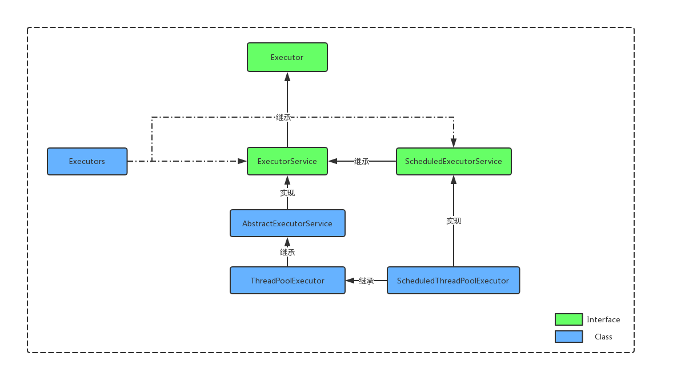
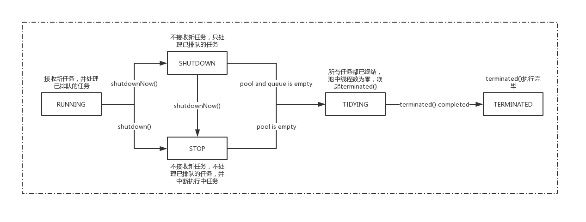
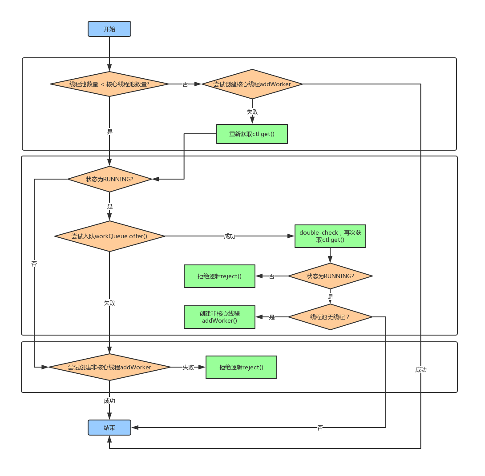
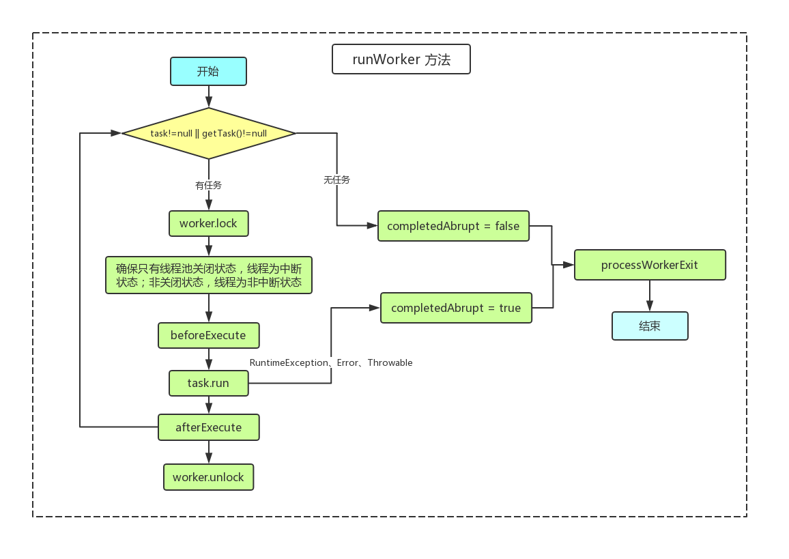
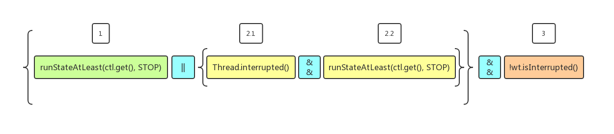

# 【重回基础】线程池框架与核心源码解读

## 一、前言

[TOC]

## 二、 线程池框架

线程池的主要框架如下：



* Executor 接口：只是简单定义了任务提交`execute`方法，该任务可能执行于新建线程，也可能是调用线程。
* ExecutorService 接口：主要是定义线程池的生命周期管理方法（如shutdown、shutdownNow等)，和返回`Future` 的可供追溯的任务提交方法（如submit、invokeAny等）。
* AbstractExecutorServie：主要提供了`ExecutorService`接口的`submit`、`invokeAny`、`invokeAll` 三个方法的实现。
* ThreadPoolExecutor：线程池的具体实现。
* ScheduledExecutorService接口：继承了`ExecutorService` 接口，定义了一些延迟，或周期性执行任务的方法。
* ScheduledThreadPoolExecutor：继承了`ThreadPoolExecutor`，实现了`ScheduledExecutorService` 接口，主要提供了延迟，或周期性执行任务方法的实现。
* Executors：提供许多静态工厂方法，包括构建`ExecutorService`、`ScheduledExecutorService`、`ThreadFactory`、`Callable`。

### 2.1 Executor 接口

仅定义了一个接口，确定了任务提交与执行解藕的方式：

```java
public interface Executor {
    /**
     * 提交执行任务，提交与执行进行解藕，任务的执行可能在新建线程，也可能在调用线程
     * @param command 待执行任务
     * @throws RejectedExecutionException 任务不被接收，执行拒绝逻辑后，抛出拒绝异常
     * @throws NullPointerException if command is null 若无若空，抛出空指针异常
     */
    void execute(Runnable command);
}
```

### 2.2 ExecutorService 接口

主要定义了线程池生命周期管理方法和带返回值的任务提交方法：

以下为生命周期管理方法：

```java
/**
 * 将线程池状态置为SHUTDOWN状态，不接受新任务，执行已提交任务。
 * 该方法并不阻塞等待所有已提交任务执行完毕，而是立即返回。
 * 若需要返回结果，可利用{@link #awaitTermination awaitTermination}
 */
void shutdown();

/**
 * 将线程池状态置为STOP状态，不接受新任务，尝试停止所有执行任务中的线程，
 * 取消所有任务队列中待执行的任务，并返回这些任务。
 * 该方法不阻塞等待执行任务中的线程关闭，而是立即返回。
 * 若需要返回结果，可利用{@link #awaitTermination awaitTermination}
 * 
 * 需要注意的是，由于Java并不提供抢占的方式，而是通过线程协作，
 * 因此，该方法只能保证尽最大努力停止执行任务中的线程。
 * 但是并不保证所有的线程都能够及时响应中断。
 */
List<Runnable> shutdownNow();

/**
 * 返回当前线程池是否处于SHUTDOWN状态
 */
boolean isShutdown();

/**
 * 返回当前线程池是否处于TERMINATED状态
 */
boolean isTerminated();

/**
 * 阻塞等待线程池状态变更为TERMINATED，或超时。
 * 可以用来阻塞等待执行shutdown()后，所有已提交任务执行完毕，
 * 或等待执行shutdownNow()后，所有线程回收，任务列表清空完成。
 */
boolean awaitTermination(long timeout, TimeUnit unit)
  throws InterruptedException;
```

以下为任务提交方法：

```java
/**
 * 提交带返回值的执行任务，数据类型为Future，执行get()获取执行结果，若执行未完成会阻塞。
 * 因此，若需要同步执行等待结果，可利用exec.submit(task).get();方式调用。
 */
<T> Future<T> submit(Callable<T> task);

/**
 * 提交实现Runnable接口的任务，若任务执行成功，返回给定的执行结果result。
 */
<T> Future<T> submit(Runnable task, T result);

/**
 * 提交实现Runnable接口的任务，若任务执行成功，返回null。
 */
Future<?> submit(Runnable task);

/**
 * 批量执行任务，当所有任务执行完毕（阻塞），返回带状态和执行结果的Future。
 */
<T> List<Future<T>> invokeAll(Collection<? extends Callable<T>> tasks)
  throws InterruptedException;

/**
 * 批量执行任务，当所有任务执行完毕，或超时，返回带状态和执行结果的Future。
 * 需要注意的是，若超时，同样会把未执行完毕的 Future 一并返回。
 */
<T> List<Future<T>> invokeAll(Collection<? extends Callable<T>> tasks,
                              long timeout, TimeUnit unit)
  throws InterruptedException;

/**
 * 给定任务列表，返回任意执行成功的任务执行结果，该方法会阻塞。
 */
<T> T invokeAny(Collection<? extends Callable<T>> tasks)
  throws InterruptedException, ExecutionException;

/**
 * 给定任务列表，返回任意，在给定时间内执行成功的任务执行结果。
 */
<T> T invokeAny(Collection<? extends Callable<T>> tasks,
                long timeout, TimeUnit unit)
  throws InterruptedException, ExecutionException, TimeoutException;
```

### 2.3 ScheduledExecutorService 接口

`ScheduledExecutorService` 继承了 `ExecutorService` 接口，因此，除了同样具备线程池生命周期管理方法和带返回值`Future`的任务提交方法，其自身提供了一些延迟，或周期性执行的任务提交方法：

```java
/**
 * 给定实现Runnable接口的任务，延迟给定的时间，执行任务。
 */
public ScheduledFuture<?> schedule(Runnable command,
                                   long delay, TimeUnit unit);

/**
 * 给定实现Callable接口的任务，延迟给定的时间，执行任务。
 */
public <V> ScheduledFuture<V> schedule(Callable<V> callable,
                                       long delay, TimeUnit unit);

/**
 * 给定实现Runnable的任务，在给定初始延迟时间后，根据给定period时间周期性执行。
 * 提交任务后，经过initialDelay执行第一次，
 * 第二次任务执行于initialDelay + period，第三次在initialDelay + 2*period，
 * 以此类推。
 * 
 * 除非任务执行上抛异常，否则，该任务只能通过取消任务，或线程池关闭来停止。
 */
public ScheduledFuture<?> scheduleAtFixedRate(Runnable command,
                                              long initialDelay,
                                              long period,
                                              TimeUnit unit);

/**
 * 给定实现Runnable的任务，在给定初始延迟时间后，首次执行任务。
 * 后继的任务，于上次任务执行完毕后，延迟给定的delay时间后执行。
 * 
 * 同样，除非任务执行上抛异常，否则，只能通过取消任务，或线程池关闭来终止。
 */
public ScheduledFuture<?> scheduleWithFixedDelay(Runnable command,
                                                     long initialDelay,
                                                     long delay,
                                                     TimeUnit unit);
```

## 三、 核心源码

### 3.1 ctl：线程池状态和线程数量

```java
private final AtomicInteger ctl = new AtomicInteger(ctlOf(RUNNING, 0));
```

线程池采用了一个原子变量同时表示线程池状态和线程数量，变量共32bit，其中高位3bit表示线程池状态，剩余的29bit表示线程数量。

线程池状态分为以下五种：

```java
private static final int COUNT_BITS = Integer.SIZE - 3;
// 接收新任务
private static final int RUNNING    = -1 << COUNT_BITS;
// 不接收新任务，执行队列中待执行任务
private static final int SHUTDOWN   =  0 << COUNT_BITS;
// 不接收新任务，不执行队列中待执行任务
private static final int STOP       =  1 << COUNT_BITS;
// 线程池的线程、任务都已清空，唤起 terminated
private static final int TIDYING    =  2 << COUNT_BITS;
// terminated 执行完毕
private static final int TERMINATED =  3 << COUNT_BITS;	
```

状态流程：



线程数量的增减，采用CAS机制：

```java
// 线程数加一
private boolean compareAndIncrementWorkerCount(int expect) {
    return ctl.compareAndSet(expect, expect + 1);
}
// 线程数减一
private boolean compareAndDecrementWorkerCount(int expect) {
    return ctl.compareAndSet(expect, expect - 1);
}
```

将线程池状态和线程数量整合为一个原子变量，该设计很巧妙：判断线程池的状态，由于状态处于高位，所以可用大小判断；获取线程数量，可利用低位29bit 1 值的 mask做位与运算。但是该设计的初衷想必不是为了节省空间，因为多一个原子整型其实也就四个字节，却耗费更多的位运算。更多的是可能为了维护状态、线程数量两个变量的原子性，防止出现一个变量改了，而另一个变量未改的状态不一致。

### 3.2 execute：任务提交

execute提交任务主要分为三个阶段，以下流程图帮助理解：



以下为源码：

```java
/**
 * 任务提交。如果线程池已关闭，或队列达到上限，
 * 则由 RejectedExecutionHandler 执行拒绝逻辑，并抛出 RejectedExecutionException 异常。
 * 主要分为3步：
 * 1. 若线程数量小于核心线程数，尝试创建新worker，该任务作为初始化任务。若成功返回，失败继续。
 * 2. 尝试让任务入队，若成功，仍需要double-check双重校验，重复检查线程池状态和线程数量。失败继续。
 * 3. 尝试创建新线程，若失败，执行拒绝逻辑。
 */
public void execute(Runnable command) {
    // 提交的任务为空，则抛出空指针异常
    if (command == null)
        throw new NullPointerException();
    
    int c = ctl.get();
    if (workerCountOf(c) < corePoolSize) {
        // 尝试创建新worker，因为方法内部具备线程池状态等校验，因此这里无需再次校验
      	if (addWorker(command, true))
            return;
        // 若创建失败，重新获取 ctl
        c = ctl.get();
    }
    // 若线程池状态为RUNNING，任务尝试进入阻塞队列
    if (isRunning(c) && workQueue.offer(command)) {
        int recheck = ctl.get();
        // double-check双重校验，再次校验状态
        if (! isRunning(recheck) && remove(command))
            reject(command);
        // double-check双重校验，再次校验线程数量，防止线程池无工作线程
        else if (workerCountOf(recheck) == 0)
            addWorker(null, false);
    }
    // 尝试创建新worker线程
    else if (!addWorker(command, false))
        // 失败执行拒绝逻辑
        reject(command);
}	
```

### 3.3 Worker 工作线程结构体

```java
/**
 * Worker 主要负责管理线程执行、中断。
 * 为防止任务执行时中断，每次执行任务时需要加锁。
 * 锁的实现通过通过继承AbstractQueuedSynchronizer简化。
 * 锁的机制为非重入互斥锁，防止通过 setCorePoolSize 等方法获取到锁，并执行中断等。
 * 另外，Worker初始化时，state设置为-1，防止线程未启动却执行中断。
 */
private final class Worker
    extends AbstractQueuedSynchronizer
    implements Runnable
{
    ...
   
    // 该 Worker 运行所在线程，便于执行 interrupt 等管理
    final Thread thread;
    // 初始化任务
    Runnable firstTask;
    // 完成任务数
    volatile long completedTasks;
    // 构造函数
    Worker(Runnable firstTask) {
        // 防止线程未开始就执行interrupt
        setState(-1);
        this.firstTask = firstTask;
        // 线程工厂创建线程
        this.thread = getThreadFactory().newThread(this);
    }
    // 工作线程的工作内容，包装在 runWorker 方法
    public void run() {
        runWorker(this);
    }
		// 是否持有独占锁，status 0：否，1:是
    protected boolean isHeldExclusively() {
        return getState() != 0;
    }
		// 采用CAS机制尝试将status由0变为1，即持有独占锁
    protected boolean tryAcquire(int unused) {
        if (compareAndSetState(0, 1)) {
            setExclusiveOwnerThread(Thread.currentThread());
            return true;
        }
        return false;
    }
		// 释放锁
    protected boolean tryRelease(int unused) {
        setExclusiveOwnerThread(null);
        setState(0);
        return true;
    }
		// 获取独占锁，若已被独占，则进入FIFO队列排队待锁，直到获取到锁
    public void lock()        { acquire(1); }
    // 尝试获取独占锁
    public boolean tryLock()  { return tryAcquire(1); }
    // 释放独占锁
    public void unlock()      { release(1); }
    // 判断是否持有独占锁
    public boolean isLocked() { return isHeldExclusively(); }
		// 将当前 Worker 所在线程标记为中断状态
    void interruptIfStarted() {
        Thread t;
        if (getState() >= 0 && (t = thread) != null && !t.isInterrupted()) {
            try {
                t.interrupt();
            } catch (SecurityException ignore) {
            }
        }
    }
}
```

### 3.4 runWorker：Worker 工作主循环

Worker 线程工作流程图：



下面是源码：

```java
/**
 * Worker 线程的循环工作内容，就是重复不停地从队列中获取任务，并执行。
 *
 * 1. 初始化任务可带可不带。只要线程池状态为 RUNNING ，那么就循环调用 getTask() 获取任务。
 *    循环结果有两种：
 *    (1) getTask() 结果为 null，一般由于线程池状态的变更，或线程池配置参数限制。
 *    (2) task.run() 出现异常，completedAbruptly 会被标记为 true，当前线程中断。
 *     
 * 2. 在执行任何任务之前，会对当前 Worker 加上互斥锁，防止 shutdown() 中断操作终止运行中的 Worker。
 *    确保除非线程池状态为关闭中，否则线程不能别中断。
 *   
 * 3. 每个任务执行前会调用 beforeExecute()，该方法若抛出异常，会导致当前线程死亡，而没有执行任务。
 *
 * 4. task.run() 任务执行抛出来的任何 RuntimeException、Error、Throwable 都会被收集交给 
 * 	  afterExecute(task, thrown) 方法，并且上抛，导致当前线程的死亡。
 * 
 * 5. afterExecute(task, thrown) 方法若抛出异常，同样会引起当前线程的死亡。
 */
final void runWorker(Worker w) {
    Thread wt = Thread.currentThread();
    Runnable task = w.firstTask;
    w.firstTask = null;
    // runWorker 开始执行后，将 status 设置为0，允许 interrupt 中断
    w.unlock();
    boolean completedAbruptly = true;
    try {
        // 判断 Worker 初始化任务是否为空
        // 若空，则 getTask() 方法从阻塞队列中尝试获取新任务，这里可能陷入长久阻塞
        // 若返回为 null，退出循环，执行 processWorkerExit() 方法处理线程终结逻辑
        while (task != null || (task = getTask()) != null) {
            // 任务执行前，会对当前 Worker 进行加锁，当然，并不是为了防止当前线程执行多任务，
            // 因为任务的获取也要等当前任务执行完毕，到下一个循环。
            // 这里的锁是为了防止例如 shutdown() 等某些方法中断执行任务中的线程。
            w.lock();
            // 总体思想就是，若线程状态为 STOP 就中断线程，若不是 STOP，则确保线程不被中断。
            // 具体：
            // 1. 若线程池状态为关闭，且当前线程未中断，则当前线程标记中断。
            // 2. 若未关闭，则执行 Thread.interrupted() && runStateAtLeast(ctl.get(), STOP) 
            // 即获取当前线程状态，并清理状态，若获取得到状态为中断，再次重新检查线程池的状态，
            // 满足则重新设置为中断状态；不满足，则在 Thread.interrupted() 已清理线程状态，直接略过。
            if ((runStateAtLeast(ctl.get(), STOP) ||
                 (Thread.interrupted() &&
                  runStateAtLeast(ctl.get(), STOP))) &&
                !wt.isInterrupted())
                wt.interrupt();
          
            try {
                // 执行前调用，子类实现
                beforeExecute(wt, task);
                Throwable thrown = null;
                try {
                    // 执行任务
                    task.run();
                } catch (RuntimeException x) {
                    thrown = x; throw x;
                } catch (Error x) {
                    thrown = x; throw x;
                } catch (Throwable x) {
                    thrown = x; throw new Error(x);
                } finally {
                    // 执行后调用，子类实现，传递收集的 thrown
                    afterExecute(task, thrown);
                }
            } finally {
                task = null;
                w.completedTasks++;
                w.unlock();
            }
        }
      	// 执行结束非中断标记
        completedAbruptly = false;
    } finally {
        // 工作线程结束处理
        processWorkerExit(w, completedAbruptly);
    }
}
```

其中，中间的判断语句比较晦涩：

```java
// If pool is stopping, ensure thread is interrupted;
// if not, ensure thread is not interrupted.  This
// requires a recheck in second case to deal with
// shutdownNow race while clearing interrupt
if ((runStateAtLeast(ctl.get(), STOP) ||
     (Thread.interrupted() &&
      runStateAtLeast(ctl.get(), STOP))) &&
    !wt.isInterrupted())
  wt.interrupt();
```

对语句进行拆解，方便阅读：



1. 首先，编号1若为true时，即线程池状态大于 STOP ，出于关闭状态。那么验证编号3，若当前线程为非中断状态，则中断，若中断则不用处理了。

2. 若编号1为false，那么验证编号2.1和2.2，获取当前线程中断状态，并将中断状态清理为false：

   若编号2.1为true，则验证编号2.2，即二次检查线程池状态，若关闭状态，则验证编号3，这时编号3必然通过，因为在编号2.1已进行清理。

   若编号2.1位false，即线程池非关闭状态，且当前线程非中断状态，不处理。

总结起来，就是确保：线程池为关闭状态时，中断线程；若非关闭状态，线程不被中断。

### 3.5 getTask() ：Worker 获取任务方法

```java
/**
 * 从阻塞队列中获取待执行任务，根据线程池的状态，可能限时或不限时阻塞。出现以下任何情况会返回 null：
 * 1. 当前线程数量大于最大线程数。
 * 2. 线程池状态为 STOP。
 * 3. 线程池状态为 SHUTDOWN，且阻塞队列为空。
 * 4. 在阻塞队列执行 poll 操作超时，且获取不到任务。
 * 可以注意到，方法若返回 null，runWorker 便不再循环，因此，这里返回 null 的地方，都对线程数量进行扣减。
 */
private Runnable getTask() {
    boolean timedOut = false;

    for (;;) {
        int c = ctl.get();
        int rs = runStateOf(c);

        // 2和3点：若线程池状态为STOP，或为SHUTDOWN且阻塞队列为空时，减少线程数计数，返回null待终结。
        if (rs >= SHUTDOWN && (rs >= STOP || workQueue.isEmpty())) {
            // 不断尝试线程数量减一，直到成功
            decrementWorkerCount();
            return null;
        }
        int wc = WorkerCountOf(c);
        // 是否需要关注超时：允许核心线程超时回收，或线程数量大于核心线程数量
        boolean timed = allowCoreThreadTimeOut || wc > corePoolSize;
				// 1和4点：线程数量大于最大线程数，或执行 poll 超时。
        if ((wc > maximumPoolSize || (timed && timedOut))
            && (wc > 1 || workQueue.isEmpty())) {
            // 尝试线程数量减一，不成功则重试
            if (compareAndDecrementWorkerCount(c))
                return null;
            continue;
        }
        try {
            // 若需要关注超时，则调用 poll，给予时限。若无需关注超时，则调用 take，长时间等待任务。
            Runnable r = timed ?
                workQueue.poll(keepAliveTime, TimeUnit.NANOSECONDS) :
                workQueue.take();
            // 若任务不为空，返回；若空，则标记超时
            if (r != null)
                return r;
            timedOut = true;
        // poll 和 take 上抛的等待中断异常
        } catch (InterruptedException retry) {
            timedOut = false;
        }
    }
}
```

### 3.6 processWorkerExit：Worker 工作结束处理方法

```java
/**
 * 主要做三件事情：
 * 1. 维护Worker线程结束后的线程池状态，比如移出woker集合，统计完成任务数。
 * 2. 检测线程池是否满足 TIDYING 状态，满足则调整状态，触发 terminated()。
 * 3. 当线程池状态为RUNNING或SHUTDOWN时，检测以下三种情况重新创建新的Worker：
 *    (1) 任务执行异常引起的Worker线程死亡。
 *    (2) 线程数量为0且任务队列不为空。
 *    (3) 若不允许核心线程超时回收，线程数量少于核心线程时。
 */
private void processWorkerExit(Worker w, boolean completedAbruptly) {
		// 若由于任务执行异常引起的线程终结，线程数量减一。
    // 非任务执行异常引起，说明是由于getTask()方法返回null，线程数量减一已在返回时处理。
    // 因此，这里只需要处理用户任务执行异常引起的线程终结。
  	if (completedAbruptly)
        decrementWorkerCount();
		// 操作线程池共享变量加锁
    final ReentrantLock mainLock = this.mainLock;
    mainLock.lock();
    try {
        completedTaskCount += w.completedTasks;
        Workers.remove(w);
    } finally {
        mainLock.unlock();
    }
		// 尝试进入 TIDYING 状态
    tryTerminate();
  
    int c = ctl.get();
    // 若线程池为 RUNNING 或 SHUTDOWN
    if (runStateLessThan(c, STOP)) {
        // 若由于任务执行异常引起则直接跳过，创建新的Worker代替
        if (!completedAbruptly) {
            // 若允许核心线程超时回收，则最低线程数量为0，否则为核心线程数
            int min = allowCoreThreadTimeOut ? 0 : corePoolSize;
            // 若最低值为0，检测任务队列是否非空，非空最低改为1
            if (min == 0 && ! workQueue.isEmpty())
                min = 1;
            // 若当前线程数量大于最低值则跳过，否则创建新的Worker代替
            if (WorkerCountOf(c) >= min)
                return;
        }
        // 创建新 Worker
        addWorker(null, false);
    }
}
```

### 3.7 addWorker：创建Worker线程

```java
/**
 * 主要负责检查是否满足线程创建条件，若满足则新建Worker线程。线程创建成功返回true；
 * 若线程池状态为STOP，或为不满足条件的SHUTDOWN时，或线程工厂创建失败时，返回false。
 * 线程创建失败也可能抛出异常，尤其是内存不足时。
 */
private boolean addWorker(Runnable firstTask, boolean core) {
    retry:
    // 外圈循环，主要判断线程池状态
    for (;;) {
        int c = ctl.get();
        int rs = runStateOf(c);

        // 判断是否允许创建新的Worker线程，看着比较拗口，实际主要拒绝以下三种场景下，进行创建线程：
        // 1. 线程池状态为STOP、TIDYING、TERMINATE。
        // 2. 线程池状态为SHUTDOWN，新任务试图进入线程池并创建新线程。
        // 3. 线程池状态为SHUTDOWN，任务队列为空。
        // 后继对该判断语句进行拆解解析
        if (rs >= SHUTDOWN &&
            ! (rs == SHUTDOWN &&
               firstTask == null &&
               ! workQueue.isEmpty()))
            return false;
        
        // 内圈循环，主要判断线程数量
        for (;;) {
            int wc = WorkerCountOf(c);
            // 若线程数量超越了ctl的bit数，或者核心线程数量已满时创建核心线程，或线程已达最大线程数
            // 则返回false，拒绝创建
            if (wc >= CAPACITY ||
                wc >= (core ? corePoolSize : maximumPoolSize))
                return false;
            // 采用CAS机制尝试线程数量加一，成功则不再进行retry外圈循环
            if (compareAndIncrementWorkerCount(c))
                break retry;
            // CAS操作线程数量加一失败，说明线程池ctl在当时已发生变化，因此重新获取
            c = ctl.get();
            // 若ctl变化的是线程池状态，则循环外圈，重新判断线程池状态
            // 若ctl变化的只是线程数量，则无需外圈循环重新判断线程池状态，只需要内圈循环，尝试线程数量加一
            if (runStateOf(c) != rs)
                continue retry;
        }
    }
	  // 线程数成功加一，开始创建Worker
    boolean WorkerStarted = false;
    boolean WorkerAdded = false;
    Worker w = null;
    try {
        // 调用Worker构造方法，内部采用了线程工厂创建线程，可能返回null，也可能抛出异常，通常因为内存不足
        w = new Worker(firstTask);
        final Thread t = w.thread;
        // 线程创建成功
        if (t != null) {
            // 操作线程池共享变量时取锁
            final ReentrantLock mainLock = this.mainLock;
            mainLock.lock();
            try {
                // 获取到锁后，重新检查线程池状态
                int rs = runStateOf(ctl.get());
								// 拿到锁后重新检查线程池状态，只允许为RUNNING或SHUTDOWN且非新建任务开辟线程时允许继续
                // 否则，释放锁，回滚线程数量
                if (rs < SHUTDOWN ||
                    (rs == SHUTDOWN && firstTask == null)) {
                    // 线程工厂创建出来的新线程已经start，则抛出线程状态异常
                    if (t.isAlive()) 
                        throw new IllegalThreadStateException();
                    // 新Worker进入集合
                  	Workers.add(w);
                    int s = Workers.size();
                    // 更新线程池最大线程数（区别于最大线程数，这个变量更多的是统计）
                    if (s > largestPoolSize)
                        largestPoolSize = s;
                    WorkerAdded = true;
                }
            } finally {
                mainLock.unlock();
            }
            // Worker入列成功，开启线程
            if (WorkerAdded) {
                t.start();
                WorkerStarted = true;
            }
        }
    } finally {
        // 若线程创建失败，则回滚
        if (! WorkerStarted)
            addWorkerFailed(w);
    }
    // 返回是否新线程启动成功
    return WorkerStarted;
}
```

其中，对中间那句比较拗口的判断语句剖析一下：

```java
// 判断是否允许创建新的Worker线程，看着比较拗口，实际主要拒绝以下三种场景下，进行创建线程：
// 1. 线程池状态为STOP、TIDYING、TERMINATE。
// 2. 线程池状态为SHUTDOWN，新任务试图进入线程池并创建新线程。
// 3. 线程池状态为SHUTDOWN，任务队列为空。
// 后继对该判断语句进行拆解解析
if (rs >= SHUTDOWN && ! (rs == SHUTDOWN && firstTask == null && ! workQueue.isEmpty()))
		return false;
```

语句可以转换成：

```java
if (rs >= SHUTDOWN && (rs != SHUTDOWN || firstTask != null || workQueue.isEmpty()))
		return false;
```

即当线程池状态大于等于SHUTDOWN时，若后续条件 `(rs != SHUTDOWN || firstTask != null || workQueue.isEmpty())` 满足任意一个，则不允许创建。

1. 先看 `rs!=SHUTDOWN`，若为true，即意味着线程池状态为STOP、TIDYING、TERMINATE，那么皆不允许创建新线程。
2. 若 `rs!=SHUTDOWN` 为false，即`rs=SHUTDOWN`。从`addWorker` 方法的调用可知，只有当任务提交新建线程时会带有 firstTask 参数。因此，第二个条件 `firstTask!=null`，用来拒绝线程池状态为SHUTDOWN时，新任务想创建线程。
3. 若前两个都不满足，即`rs=SHUTDOWN`且`firstTask=null`，那么验证第三个条件`workQueue.isEmpty()`，若任务线程为空，则满足拒绝创建；若非空则允许创建。

## 参考

1. [Java线程池和ThreadPoolExecutor使用和分析(一)](https://www.cnblogs.com/trust-freedom/p/6681948.html)
2. [Java线程池和ThreadPoolExecutor使用和分析(二)](https://www.cnblogs.com/trust-freedom/p/6681948.html)

