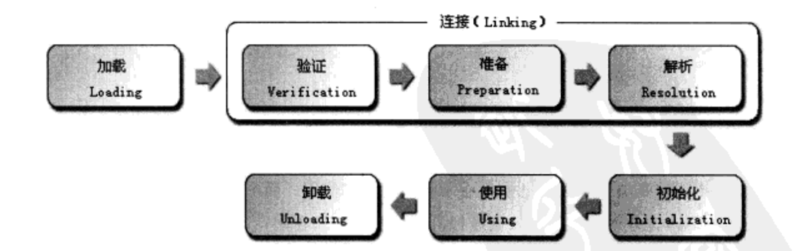

# 【重回基础】设计模式：你真的懂单例模式吗

## 目录

[TOC]

## 一、前言

单例模式是我们大部分人接触的第一个设计模式，因此网上的分享泛滥，良莠不齐，甚至出现不少错误。因为比较简单，所以没有自行研究学习，只是从网上的分享中吸收。前不久与同事的交流中发现与自己的认知有些出入，因此回顾了一下，也便有了此文。

学习任何东西都离不开 what、why、how 的疑问：

**什么是单例模式？**

即确保某个类只创建一个实例，访问者只能通过该实例访问该类。

**为什么需要单例模式？**

个人理解主要有三点：

1. 业务需要，比如，应用中的配置类，主窗口句柄等，为了保证全局只有一个实例，防止引起业务异常。
2. 便于资源统一管理，比如连接池、日志输出等。
3. 避免重复创建，节省重复性的内存开辟实例化的消耗。

**如何实现单例模式？**

单例的实现简单，整体上主要包括以下三个步骤：

1. 私有化构造，防止外部创建。
2. 在内部创建实例。
3. 提供访问实例的静态公有方法。

具体的实现上，网上许多分享都提供了七八种的方式，分为线程安全和非安全版等。个人认为，实际上归根结底就只有四种：饿汉，懒汉，静态内部类，枚举。因为静态代码块和静态变量的实现方式都属于饿汉；DCL 和 同步方法都属于懒汉。知道各自原理、特点、注意点，再根据需求进行调整即可。

后文会对具体实现方式展开介绍，这里先总结各自特点：

| 序号 | 实现方式   | 懒加载 | 天然防止反射破坏 | 天然防止反序列化破坏 |
| ---- | ---------- | ------ | ---------------- | -------------------- |
| 1    | 饿汉       | 否     | 否               | 否                   |
| 2    | 懒汉       | 是     | 否               | 否                   |
| 3    | 静态内部类 | 是     | 否               | 否                   |
| 4    | 枚举类     | 否     | 是               | 是                   |

为何第四、五列防止单例破坏要加上天然二字，这是因为经过第四章介绍的处理方法，各种单例的实现方式都能够做到防止反射/反序列化破坏。因此加上天然二字，反映第三章介绍的原始实现方式的防止破坏情况。

## 二、 相关知识

### 1. 类加载流程

先回顾一下 JVM 类加载的流程，主要包括加载、连接、初始化三个阶段。非本篇重点，因此简单回顾一下：



加载阶段，主要就是将二进制字节流通过类加载器，加载进JVM，并按照所需格式存储。

验证流程，主要就是出于JVM安全考虑，检查二进制字节流是否符合JVM规范。

准备流程，主要就是为静态变量开辟内存，并赋予默认初始值，比如 `private static Date d = new Date()` ，在本流程里，只是开辟了引用 `d` ，并将其赋值为 `null`，而非执行构造方法。若是静态常量，则赋予初始化后的值。

解析流程，主要就是将常量池符号引用替换为直接应用。

初始化阶段，主要就是执行构造方法赋予初始值，需要注意的是仅对静态变量。

### 2. 序列化、序列化攻击

具体不再赘述，可见：[【重回基础】序列化、序列化攻击与序列化代理](https://blog.csdn.net/Patrick_Lam/article/details/100043134) 

## 三、实现方式

### 1. 饿汉

之所以名为饿汉，故名思义就是很“饥渴”，在类加载时，就急不可耐将引用的对象实例化，因此，后续无需担心对象开辟/多线程等问题，但不具备懒加载特点。

实现十分简单，如下，也可以通过静态块执行初始化。

```java
public class HungrySingle {
  	// 注意点1:用final修饰
    private static final HungrySingle instance = new HungrySingle();
    private HungrySingle() {}
    public static HungrySingle getInstance() {
        return instance;
    }
}
```

需要注意的是引用要采用`final`修饰，为了防止指令重排影响安全发布。因为`private static final HungrySingle instance = new HungrySingle();`看着是一行代码，实际上分为三个步骤，且不具备原子性。步骤分为：

1. 首先，为实例开辟内存空间。
2. 其次，调用构造方法初始化对象，存储于步骤1开辟的内存。
3. 最后，将 instance 引用指向该内存空间。

而虚拟机和CPU为了执行效率，在不同的维度上都对指令进行了重排，`getInstance()`可能发生于构造完成之前（即步骤2前），也可能发生于构造完成但步骤3未完成。而`final`修饰的变量具备可见性，并且防止指令重排影响安全发布，能够保证对于该变量的读写发生于以上三个步骤完成之后。

下面为反射及序列化测试，验证是否可以通过反射/序列化手段创建新的实例，破坏单例：

```java
 public static void main(String[] args) throws Exception {
        LazySingle ori = getInstance();
        // 反射测试
        LazySingle refeInst = LazySingle.class.newInstance();
        System.out.println(refeInst);
        System.out.println(ori);
        System.out.println(refeInst == ori); // 结果为 false
        // 序列化测试
        ByteArrayOutputStream byteArrayOutputStream = new ByteArrayOutputStream();
        ObjectOutputStream objectOutputStream = new ObjectOutputStream(byteArrayOutputStream);
        objectOutputStream.writeObject(ori);
        ByteArrayInputStream byteArrayInputStream = new ByteArrayInputStream(byteArrayOutputStream.toByteArray());
        ObjectInputStream objectInputStream = new ObjectInputStream(byteArrayInputStream);
        LazySingle serializeInst = (LazySingle) objectInputStream.readObject();
        System.out.println(serializeInst);
        System.out.println(ori);
        System.out.println(serializeInst == ori); // 结果为 false        
 }
```

可以看到，饿汉的实现方式并不具备防止单例破坏的能力，但是我们可以做额外的处理，具体方式见后文。


### 2. 懒汉

之所以名为懒汉，相比饿汉，比较懒，有拖延症，在类加载时只是定义了一个空引用，并不开辟内存进行实例化，一直拖到调用时才进行实例化，因此具备懒加载特点。

实现如下：

```java
public class LazySingle {
    private LazySingle() {}
    // 注意点1: 要用volatile修饰
    private static volatile LazySingle instance = null;
    public static LazySingle getInstance() {
        // 注意点2: DCL, double check lock
        if (instance == null) {
            synchronized (LazySingle.class) {
                if (instance == null) {
                    instance = new LazySingle();
                }
            }
        }
        return instance;
    }
}
```

其中需要注意的是：

前文有言，引用对象的实例化实际上分为三个步骤，并且不具备原子性：

1. 首先，为实例开辟内存空间。
2. 其次，调用构造方法初始化对象，存储于步骤1开辟的内存。
3. 最后，将 instance 引用指向该内存空间。

虚拟机和CPU为了执行效率，在不同的维度上都对指令进行了重排，所以步骤2、3的执行顺序具有不确定性：可能先将引用指向内存空间再调用构造方法；也可能先完成构造后，再将引用指向该内存空间。

因此，需要采用`volatitle`修饰变量，在该变量读写时插入相应的内存屏障，防止指令重排影响读写顺序。而这里`volatitle`与`fianl`的主要区别在于引用指向的修改。


在同步快2外面增加空判断对效率起到很大作用，因为，只有在对象未实例化时才需要进入同步块执行初始化，之后该同步块更多时候十分影响效率，因此，外面的空判断可以防止进入无用的同步等待，提高效率。

下面为反射及序列化测试，验证是否可以通过反射/序列化手段创建新的实例，破坏单例：

```java
    public static void main(String[] args) throws Exception {
        HungrySingle ori = getInstance();
        // 反射测试
        HungrySingle refeInst = HungrySingle.class.newInstance();
        System.out.println(refeInst);
        System.out.println(ori);
        System.out.println(refeInst == ori); // 结果为 false
        // 序列化测试
        ByteArrayOutputStream byteArrayOutputStream = new ByteArrayOutputStream();
        ObjectOutputStream objectOutputStream = new ObjectOutputStream(byteArrayOutputStream);
        objectOutputStream.writeObject(ori);
        ByteArrayInputStream byteArrayInputStream = new ByteArrayInputStream(byteArrayOutputStream.toByteArray());
        ObjectInputStream objectInputStream = new ObjectInputStream(byteArrayInputStream);
        HungrySingle serializeInst = (HungrySingle) objectInputStream.readObject();
        System.out.println(serializeInst);
        System.out.println(ori);
        System.out.println(serializeInst == ori); // 结果为 false
 }
```

可见，懒汉的实现方式同样并不具备防止单例破坏的能力，需要我们做额外的处理，具体方式见后文。

### 3. 静态内部类

静态内部类的单例就是在类的内部提供了一个静态内部类，内部类采用饿汉的方式定义声明实例。由于JVM对于内部类不会立即加载，而是等到使用时才进行加载，因此静态内部类的单例实现方式具备懒加载的特点。

实现如下：

```java
public class InnerSingle {
    private InnerSingle() {}
    private static class Inner {
        private static final InnerSingle inst = new InnerSingle();
    }
    public static InnerSingle getInstance() {
        return Inner.inst;
    }
}
```

下面为反射及序列化测试，验证是否可以通过反射/序列化手段创建新的实例，破坏单例：

```java
public static void main(String[] args) throws Exception {
        InnerSingle ori = getInstance();
        // 反射测试
        InnerSingle refeInst = InnerSingle.class.newInstance();
        System.out.println(ori);
        System.out.println(refeInst);
        System.out.println(refeInst == ori); // 结果为 false
        // 序列化测试
        ByteArrayOutputStream byteArrayOutputStream = new ByteArrayOutputStream();
        ObjectOutputStream objectOutputStream = new ObjectOutputStream(byteArrayOutputStream);
        objectOutputStream.writeObject(ori);
        ByteArrayInputStream byteArrayInputStream = new ByteArrayInputStream(byteArrayOutputStream.toByteArray());
        ObjectInputStream objectInputStream = new ObjectInputStream(byteArrayInputStream);
        InnerSingle serializeInst = (InnerSingle) objectInputStream.readObject();
        System.out.println(serializeInst);
        System.out.println(ori);
        System.out.println(serializeInst == ori); // 结果为 false
 }
```

可见，静态内部类同样无法防止单例破坏，需要做额外的处理，具体方式见后文。

### 4. 枚举

从JDK1.5起，新增了枚举类型，它其实就是通过公有的静态final域为每个枚举常量导出实例的类，没有任何可以访问的构造方法，因此当它加载进JVM，它就是一个真正的final。当然，也正因此其不具备懒加载的特点。

实现如下，看着异常简单，与C++没有什么区别，其实不然，Java的枚举类型十分强大且安全，可以根据枚举的特点做很多事，这也是为何《Effective Java》一直推荐优先用枚举实现的原因。

```java
public enum EnumSingle {
    INSTANCE;
    EnumSingle() { }
    // 事实上枚举很强大，这里可以做很多事情
}
```

下面为反射及序列化测试，验证是否可以通过反射/序列化手段创建新的实例，破坏单例：

```java
public static void main(String[] args) throws Exception {
        EnumSingle ori = EnumSingle.INSTANCE;
        // 反射测试
        EnumSingle refeInst = EnumSingle.class.newInstance(); // 这里会抛出InstantiationException异常
        System.out.println(ori);
        System.out.println(refeInst);
        System.out.println(refeInst == ori);
        // 序列化测试
        ByteArrayOutputStream byteArrayOutputStream = new ByteArrayOutputStream();
        ObjectOutputStream objectOutputStream = new ObjectOutputStream(byteArrayOutputStream);
        objectOutputStream.writeObject(ori);
        ByteArrayInputStream byteArrayInputStream = new ByteArrayInputStream(byteArrayOutputStream.toByteArray());
        ObjectInputStream objectInputStream = new ObjectInputStream(byteArrayInputStream);
        EnumSingle serializeInst = (EnumSingle) objectInputStream.readObject();
        System.out.println(serializeInst);
        System.out.println(ori);
        System.out.println(serializeInst == ori); // 结果为 true
 }
```

从以上实验可以看出，枚举无法通过反射访问构造方法，而反序列化出来的实例与原来同一个实例，因此，天然具备防止通过反射和序列化破坏单例的机制。

## 四、防止单例破坏处理方法

### 1. 反射

我们都知道，通过反射可以访问到私有的构造方法，进而创建出新的实例。因此，要防止通过反射机制破坏单例，我们只需要在构造方法检测是否有实例，若有实例则抛出异常，禁止创建新的实例。

```
// 构造方法
private InnerSingle() {
		Assert.check(Inner.inst == null);
}
```

### 2. 反序列化

之前笔者写了篇相关文章[【重回基础】序列化、序列化攻击与序列化代理](https://blog.csdn.net/Patrick_Lam/article/details/100043134) 。其中有说到，反序列化机制就像是一个隐形的构造器，因此，可以通过这个隐形的构造器创建出新的实例，进而破坏单例。我们可以通过提供 `readResolve` 方法，用原有的实例代替反序列化出来的实例返回。

```
// 提供 readResolve 方法，并用原有实例代替反序列化出来的实例返回
public Object readResolve() {
		return Inner.inst;
}
```

## 参考

1. 《Effective Java》 Joshua Bloch